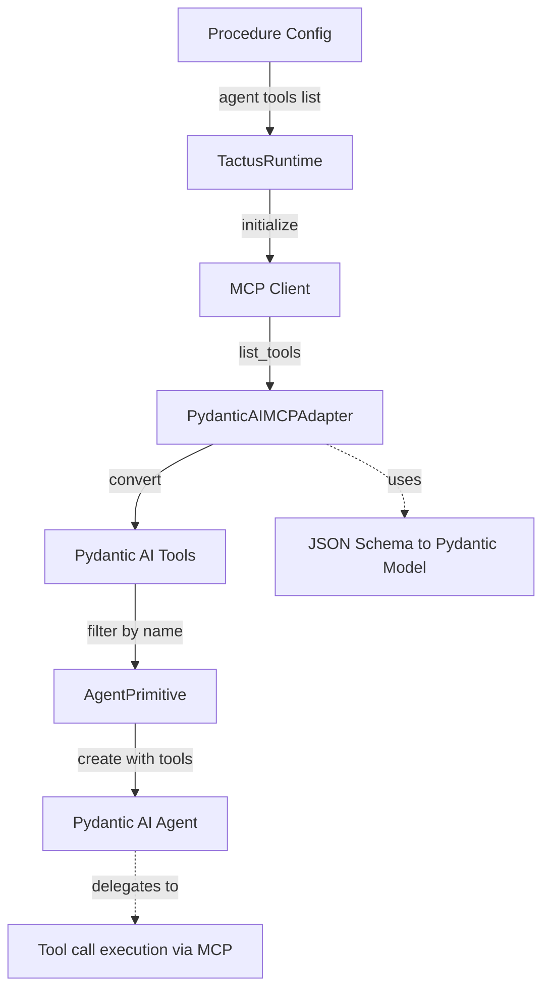
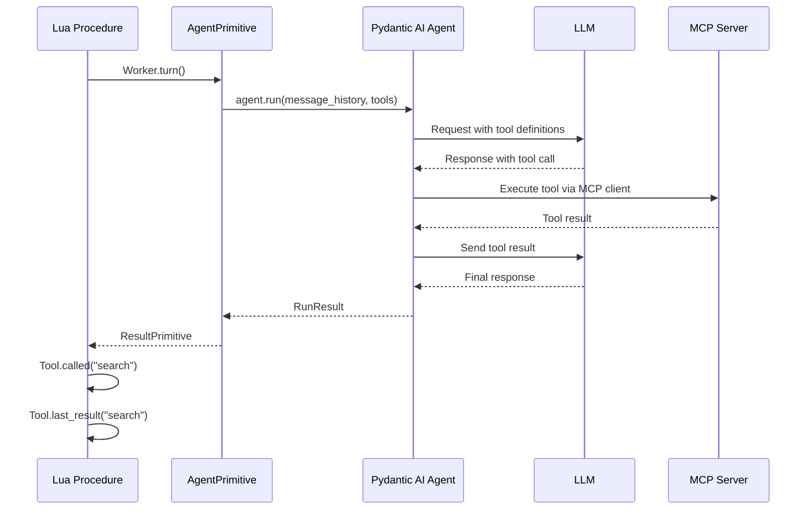

# Tactus Tool Roadmap

This document outlines Tactus's tool support strategy, current implementation status, and planned features. Our goal is to provide a thin, elegant layer over Pydantic AI's comprehensive tool ecosystem while maintaining Tactus's Lua-first design philosophy.

## Design Philosophy

**Thin Layer Principle**: Tactus tools should be a minimal abstraction over Pydantic AI's tool features. Anything Pydantic AI supports, Tactus should support with minimal additional complexity.

**Lua-First API**: Tool configuration and usage should feel natural in Lua while mapping cleanly to Pydantic AI's Python API.

**MCP-Native**: Model Context Protocol (MCP) servers are first-class citizens in Tactus, enabling seamless integration with external tool ecosystems.

## Current Implementation Status

### ✅ Implemented and Tested

#### 1. Per-Turn Tool Control
**Status**: ✅ Complete

Dynamic control of tool availability for individual agent turns:

```lua
repeat
    -- Main turn: agent has all tools
    Researcher.turn()
    
    -- If tool was called, summarize with NO tools
    if Tool.called("search") then
        Researcher.turn({
            inject = "Summarize the search results",
            tools = {}  -- No tools for this turn
        })
    end
until Tool.called("done")
```

**Implementation**:
- `Agent.turn(opts)` accepts optional table with `tools`, `inject`, and model parameter overrides
- Uses Pydantic AI's `agent.override(tools=...)` context manager
- Helper methods: `_get_tools_for_turn()`, `_filter_tools_by_name()`

**Use Cases**:
- Tool result summarization (prevent recursive tool calls)
- Stage-specific tool access
- Injected guidance with restricted capabilities

**Example**: [`examples/14-feature-per-turn-tools.tac`](../examples/14-feature-per-turn-tools.tac)

#### 2. Tool Call Tracking
**Status**: ✅ Complete

Track which tools were called and access their results:

```lua
if Tool.called("search") then
    local result = Tool.last_result("search")
    local call_info = Tool.last_call("search")
    -- call_info.args, call_info.result
end
```

**Implementation**: `ToolPrimitive` ([`tactus/primitives/tool.py`](../tactus/primitives/tool.py))

### 🚧 Implemented but Untested

#### 3. Basic Function Tools
**Status**: 🚧 Code exists, never tested

Tools are registered in agent definitions and automatically converted to Pydantic AI `Tool` instances:

```lua
agent("worker", {
    provider = "openai",
    model = "gpt-4o",
    system_prompt = "You are a helpful assistant",
    tools = {"search", "analyze", "done"}
})
```

**Implementation**: 
- Tools loaded from MCP server via `PydanticAIMCPAdapter` ([`tactus/adapters/mcp.py`](../tactus/adapters/mcp.py))
- Automatic "done" tool injection for all agents
- Tool call tracking via `ToolPrimitive` ([`tactus/primitives/tool.py`](../tactus/primitives/tool.py))

**Pydantic AI Features Used**:
- `Tool` class for tool definitions
- `@agent.tool` and `@agent.tool_plain` decorators (internal)
- Automatic argument validation
- Tool call tracking in message history

**What's Missing**:
- No end-to-end test with real MCP server
- No example file demonstrating MCP tool usage
- Unknown: Does tool execution actually work?
- Unknown: Does JSON Schema conversion work correctly?

#### 4. MCP Server Integration
**Status**: 🚧 Code exists, never tested

Tactus loads tools from MCP servers and makes them available to agents:

```lua
-- Tools from MCP server are automatically available
agent("worker", {
    provider = "openai",
    model = "gpt-4o",
    tools = {"mcp_tool_name", "done"}
})
```

**Implementation**:
- `PydanticAIMCPAdapter` converts MCP tool definitions to Pydantic AI Tools
- JSON Schema → Pydantic model conversion
- Automatic tool call execution via MCP client
- Tool result tracking

**Current Limitations**:
- Only supports function tools from MCP (not prompts or resources yet)
- Single MCP server per runtime instance
- No dynamic MCP server loading

**What's Missing**:
- No test with real MCP server (e.g., Plexus MCP)
- No example file
- No documentation on MCP server configuration
- Unknown: Does it actually work end-to-end?

---

## Planned Features

### 🚧 High Priority

#### 1. Test and Fix MCP Integration
**Status**: ❌ Not Started  
**Priority**: Critical

Actually test the MCP adapter code with a real MCP server (Plexus MCP).

**What Needs Testing**:
1. MCP server connection and tool discovery
2. JSON Schema → Pydantic model conversion
3. Tool execution end-to-end
4. Tool result handling
5. Error cases (connection failures, invalid schemas, etc.)

**Deliverables**:
- Working example with Plexus MCP server
- Integration test
- Documentation on MCP configuration

#### 2. LangChain Tool Integration
**Status**: ❌ Not Started  
**Priority**: High

Enable use of LangChain's extensive tool library.

**Pydantic AI Support**: `tool_from_langchain()` and `LangChainToolset`

**Proposed Tactus API**:

```lua
-- Option A: Import LangChain tools in procedure config
langchain_tools = {
    "DuckDuckGoSearchRun",
    "WikipediaQueryRun"
}

agent("researcher", {
    provider = "openai",
    model = "gpt-4o",
    tools = {"search", "done"},  -- MCP tools
    langchain_tools = {"DuckDuckGoSearchRun"}  -- LangChain tools
})
```

**Implementation Plan**:
1. Add `LangChainAdapter` similar to `PydanticAIMCPAdapter`
2. Support `langchain_tools` field in agent config
3. Convert LangChain tools to Pydantic AI format at runtime
4. Document installation requirements (`langchain-community`)

**Benefits**:
- Access to 100+ pre-built tools
- Integration with existing LangChain ecosystems
- Rapid prototyping with community tools

**References**: 
- [Pydantic AI LangChain Tools](https://ai.pydantic.dev/third-party-tools/#langchain-tools)
- [LangChain Tool Library](https://python.langchain.com/docs/integrations/tools/)

#### 3. Built-in Tool Support
**Status**: ❌ Not Started  
**Priority**: High

Support Pydantic AI's built-in tools (web search, code execution, image generation, etc.).

**Pydantic AI Support**: `WebSearchTool`, `CodeExecutionTool`, `ImageGenerationTool`, `WebFetchTool`, `MemoryTool`, `MCPServerTool`

**Proposed Tactus API**:

```lua
agent("researcher", {
    provider = "openai",
    model = "gpt-4o",
    tools = {"done"},
    
    -- Built-in tools provided by model provider
    builtin_tools = {
        {
            type = "web_search",
            search_context_size = "high",
            user_location = {
                city = "San Francisco",
                country = "US"
            }
        },
        {
            type = "code_execution"
        }
    }
})
```

**Implementation Plan**:
1. Add `builtin_tools` field to agent config
2. Parse builtin tool configurations
3. Create Pydantic AI builtin tool instances
4. Pass to `Agent(builtin_tools=[...])`
5. Handle provider-specific limitations

**Supported Tools**:
- `web_search` - Search the web (OpenAI Responses, Anthropic, Google, Groq)
- `code_execution` - Execute code securely (OpenAI, Anthropic, Google)
- `image_generation` - Generate images (OpenAI Responses, Google)
- `web_fetch` - Fetch URL contents (Anthropic, Google)
- `memory` - Persistent memory (Anthropic)
- `mcp_server` - Remote MCP servers (OpenAI Responses, Anthropic)

**References**: [Pydantic AI Built-in Tools](https://ai.pydantic.dev/builtin-tools/)

#### 4. Common Tool Library
**Status**: ❌ Not Started  
**Priority**: Medium

Integrate Pydantic AI's common tools (DuckDuckGo, Tavily).

**Pydantic AI Support**: `duckduckgo_search_tool()`, `tavily_search_tool()`

**Proposed Tactus API**:

```lua
agent("researcher", {
    provider = "openai",
    model = "gpt-4o",
    tools = {"done"},
    
    -- Common tools from Pydantic AI
    common_tools = {
        {
            type = "duckduckgo_search",
            max_results = 5
        },
        {
            type = "tavily_search",
            api_key = env.TAVILY_API_KEY
        }
    }
})
```

**Implementation Plan**:
1. Add `common_tools` field to agent config
2. Create tool instances based on type
3. Handle API key configuration
4. Document installation requirements

**References**: [Pydantic AI Common Tools](https://ai.pydantic.dev/common-tools/)

#### 5. Multiple MCP Server Support
**Status**: ❌ Not Started  
**Priority**: High

Support multiple MCP servers per procedure.

**Current Limitation**: Only one MCP server per runtime instance.

**Proposed Tactus API**:

```lua
-- Define MCP servers at procedure level
mcp_servers = {
    plexus = {
        command = "python",
        args = {"-m", "plexus.mcp"},
        env = {PLEXUS_ACCOUNT_KEY = env.PLEXUS_KEY}
    },
    filesystem = {
        command = "npx",
        args = {"-y", "@modelcontextprotocol/server-filesystem", "/workspace"}
    }
}

agent("worker", {
    provider = "openai",
    model = "gpt-4o",
    -- Tools from different MCP servers
    tools = {
        "plexus_score_info",      -- From plexus server
        "filesystem_read_file",   -- From filesystem server
        "done"
    }
})
```

**Implementation Plan**:
1. Add `mcp_servers` section to procedure config
2. Initialize multiple MCP clients in runtime
3. Namespace tools by server (e.g., `plexus_*`, `filesystem_*`)
4. Load tools from all servers and merge
5. Route tool calls to correct server

**Benefits**:
- Use multiple tool sources in one procedure
- Isolate tool namespaces
- Better organization for complex workflows

---

### 🔮 Medium Priority

#### 6. Tool Retries and Validation
**Status**: ❌ Not Started  
**Priority**: Medium

Expose Pydantic AI's tool retry and validation features.

**Pydantic AI Support**: `ModelRetry` exception, automatic validation retries

**Proposed Tactus API**:

```lua
agent("worker", {
    provider = "openai",
    model = "gpt-4o",
    tools = {"search", "done"},
    
    tool_config = {
        retries = 3,
        retry_delay = 1.0,
        timeout = 30  -- Per-tool timeout
    }
})
```

**Implementation Plan**:
1. Add `tool_config` to agent definition
2. Pass retry settings to Pydantic AI
3. Expose `ModelRetry` in Lua for custom tools
4. Add timeout support

**References**: [Pydantic AI Tool Retries](https://ai.pydantic.dev/tools-advanced/#tool-execution-and-retries)

#### 7. Sequential vs Parallel Tool Execution
**Status**: ❌ Not Started  
**Priority**: Medium

Control whether tools run concurrently or sequentially.

**Pydantic AI Support**: `agent.sequential_tool_calls()` context manager, per-tool `sequential` flag

**Proposed Tactus API**:

```lua
agent("worker", {
    provider = "openai",
    model = "gpt-4o",
    tools = {"search", "analyze", "done"},
    
    tool_execution = "parallel"  -- or "sequential"
})

-- Or per-turn override
Worker.turn({
    tools = {"search", "analyze"},
    sequential = true  -- Force sequential for this turn
})
```

**Implementation Plan**:
1. Add `tool_execution` mode to agent config
2. Use `agent.sequential_tool_calls()` context manager when needed
3. Support per-turn override via `turn(opts)`

**References**: [Pydantic AI Parallel Tool Calls](https://ai.pydantic.dev/tools-advanced/#parallel-tool-calls-concurrency)

#### 8. Tool Output Types (Advanced Returns)
**Status**: ❌ Not Started  
**Priority**: Medium

Support rich tool returns with multi-modal content and metadata.

**Pydantic AI Support**: `ToolReturn` with `return_value`, `content`, and `metadata`

**Use Case**: Tools that return images, documents, or structured data alongside text.

**Proposed Tactus API**:

```lua
-- Custom tool in Lua that returns rich content
function screenshot_tool(x, y)
    local image_data = capture_screen()
    return {
        return_value = "Screenshot captured",
        content = {
            "Captured screen at coordinates:",
            {type = "image", data = image_data}
        },
        metadata = {
            coordinates = {x = x, y = y},
            timestamp = os.time()
        }
    }
end
```

**Implementation Plan**:
1. Support `ToolReturn` in MCP adapter
2. Handle multi-modal content in tool results
3. Expose metadata to Lua via `Tool.last_call()`

**References**: [Pydantic AI Advanced Tool Returns](https://ai.pydantic.dev/tools-advanced/#advanced-tool-returns)

#### 9. Dynamic Tool Preparation (prepare_tools)
**Status**: ❌ Not Started  
**Priority**: Low

Support agent-wide tool preparation function for modifying all tool definitions before each step.

**Pydantic AI Support**: `prepare_tools` parameter to `Agent`, per-tool `prepare` method

**Proposed Tactus API**:

```lua
agent("worker", {
    provider = "openai",
    model = "gpt-4o",
    tools = {"search", "done"},
    
    -- Modify tool definitions before each turn
    prepare_tools = function()
        local context = State.get("search_context") or "general"
        
        return {
            search = {
                description = "Search for information about " .. context
            }
        }
    end
})
```

**Note**: This is more advanced than per-turn tool filtering. Most use cases are covered by `turn({tools = {...}})`.

**References**: [Pydantic AI Dynamic Tools](https://ai.pydantic.dev/tools-advanced/#dynamic-tools)

#### 10. ACI.dev Tool Integration
**Status**: ❌ Not Started  
**Priority**: Low

Support ACI.dev's tool library.

**Pydantic AI Support**: `tool_from_aci()` and `ACIToolset`

**Proposed Tactus API**:

```lua
agent("worker", {
    provider = "openai",
    model = "gpt-4o",
    tools = {"done"},
    
    aci_tools = {
        "OPEN_WEATHER_MAP__CURRENT_WEATHER",
        "OPEN_WEATHER_MAP__FORECAST"
    },
    
    aci_config = {
        linked_account_owner_id = env.ACI_ACCOUNT_ID
    }
})
```

**References**: [Pydantic AI ACI Tools](https://ai.pydantic.dev/third-party-tools/#aci-dev-tools)

---

### 🌙 Future Considerations

#### 11. Deferred Tools (Human-in-the-Loop Tool Approval)
**Status**: ❌ Not Started  
**Priority**: Low

Support tools that require human approval before execution.

**Pydantic AI Support**: `ApprovalRequired` exception, `DeferredToolRequests`, `DeferredToolResults`

**Note**: Tactus already has comprehensive HITL primitives (`Human.approve()`, etc.). This feature would add tool-level approval, which is more granular.

**Proposed Tactus API**:

```lua
agent("admin", {
    provider = "openai",
    model = "gpt-4o",
    tools = {"delete_file", "done"},
    
    tool_approval = {
        delete_file = function(args)
            -- Require approval for protected files
            if args.path:match("^%.env") then
                return true  -- Require approval
            end
            return false  -- No approval needed
        end
    }
})
```

**References**: [Pydantic AI Deferred Tools](https://ai.pydantic.dev/deferred-tools/)

#### 12. External Tool Execution
**Status**: ❌ Not Started  
**Priority**: Low

Support tools executed outside the agent process (long-running tasks, client-side tools).

**Pydantic AI Support**: `CallDeferred` exception, `ExternalToolset`

**Use Cases**:
- Long-running background tasks
- Client-side tools (browser, mobile app)
- Tools requiring external services

**Note**: This is complex and may not fit Tactus's synchronous execution model well.

**References**: [Pydantic AI External Tools](https://ai.pydantic.dev/deferred-tools/#external-tool-execution)

#### 13. Custom Toolsets
**Status**: ❌ Not Started  
**Priority**: Low

Support custom toolset implementations for advanced use cases.

**Pydantic AI Support**: `AbstractToolset`, `FunctionToolset`, `WrapperToolset`, etc.

**Proposed Tactus API**:

```lua
-- Define custom toolset in Lua
toolset("logging_tools", {
    tools = {"log_info", "log_error"},
    
    -- Wrapper that logs all tool calls
    on_call = function(tool_name, args)
        Log.info("Tool called", {name = tool_name, args = args})
    end,
    
    on_result = function(tool_name, result)
        Log.info("Tool completed", {name = tool_name, result = result})
    end
})
```

**References**: [Pydantic AI Toolsets](https://ai.pydantic.dev/toolsets/)

---

## Current Architecture

### Tool Loading Flow



### Tool Call Flow



---

## Design Decisions

### Why Thin Layer?

1. **Leverage Pydantic AI's Maturity**: Pydantic AI has extensive tool support with proper validation, error handling, and retry logic. We don't need to reinvent this.

2. **Stay Focused**: Tactus's value is in Lua orchestration, HITL, and BDD testing. Tools are a means to that end.

3. **Easy Migration**: As Pydantic AI adds tool features, Tactus can adopt them quickly with minimal code changes.

4. **Predictable Behavior**: Users familiar with Pydantic AI tools will understand Tactus tools immediately.

### Tool Naming Convention

**MCP Tools**: Use original names from MCP server (e.g., `plexus_score_info`)

**Built-in Tools**: Use snake_case type names (e.g., `web_search`, `code_execution`)

**LangChain Tools**: Use original class names (e.g., `DuckDuckGoSearchRun`)

**Common Tools**: Use descriptive names (e.g., `duckduckgo_search`, `tavily_search`)

### Configuration Location

**Agent-Level**: Tools are configured per agent, not per procedure. This allows:
- Different agents to have different tool access
- Tool configuration to be reusable
- Clear ownership (which agent can call which tools)

**Procedure-Level**: Only MCP server definitions and global tool settings.

---

## Testing Strategy

### Unit Tests
- Test tool conversion (MCP → Pydantic AI)
- Test tool filtering by name
- Test per-turn tool overrides
- Test tool call tracking

### Integration Tests
- Test MCP server tool loading
- Test tool execution end-to-end
- Test LangChain tool integration
- Test built-in tool usage

### BDD Specifications
- Verify tool call patterns in workflows
- Test tool result handling
- Test error cases (missing tools, failed calls)

### Example Files
- One example per tool integration type
- Real-world patterns (tool result summarization, etc.)
- Performance benchmarks for tool-heavy workflows

---

## Open Questions

### 1. Tool Namespacing with Multiple MCP Servers

**Question**: How do we handle tool name conflicts between MCP servers?

**Options**:
- **A**: Automatic prefixing (e.g., `plexus_score_info`, `filesystem_read_file`)
- **B**: Manual aliasing in config
- **C**: First-come-first-served (later tools override)

**Recommendation**: Option A (automatic prefixing) - most predictable and explicit.

### 2. Built-in Tool Configuration

**Question**: Should built-in tools be in `builtin_tools` array or mixed with regular `tools`?

**Options**:
- **A**: Separate `builtin_tools` field (clearer separation)
- **B**: Mixed in `tools` with special syntax (e.g., `"builtin:web_search"`)

**Recommendation**: Option A (separate field) - clearer intent, easier to validate.

### 3. LangChain Tool Installation

**Question**: How do we handle LangChain tool dependencies?

**Options**:
- **A**: Document in error messages (e.g., "Install langchain-community")
- **B**: Auto-install via pip (risky)
- **C**: Validate at parse time and fail early

**Recommendation**: Option C (validate early) - better UX, clear errors.

---

## References

### Pydantic AI Documentation
- [Function Tools](https://ai.pydantic.dev/tools/)
- [Advanced Tool Features](https://ai.pydantic.dev/tools-advanced/)
- [Toolsets](https://ai.pydantic.dev/toolsets/)
- [Built-in Tools](https://ai.pydantic.dev/builtin-tools/)
- [Common Tools](https://ai.pydantic.dev/common-tools/)
- [Third-Party Tools](https://ai.pydantic.dev/third-party-tools/)
- [Deferred Tools](https://ai.pydantic.dev/deferred-tools/)

### External Resources
- [Model Context Protocol](https://modelcontextprotocol.io/)
- [LangChain Tool Library](https://python.langchain.com/docs/integrations/tools/)
- [ACI.dev Tools](https://www.aci.dev/tools)

---

## Changelog

### v0.x.x (Current)
- ✅ Basic function tools via MCP
- ✅ Per-turn tool control (`turn({tools = {...}})`)
- ✅ Tool call tracking primitives
- ✅ Single MCP server support

### Planned
- 🚧 LangChain tool integration
- 🚧 Built-in tool support
- 🚧 Common tool library
- 🚧 Multiple MCP server support
- 🔮 Tool retries and validation
- 🔮 Sequential vs parallel execution
- 🔮 Advanced tool returns
- 🔮 Dynamic tool preparation
