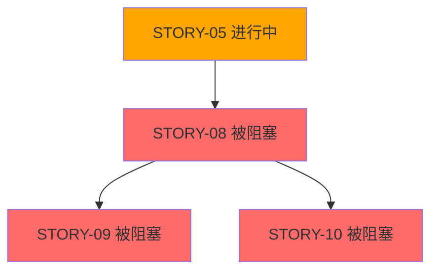

# 项目状态查看指南

自动生成项目当前进度报告，帮助快速了解项目整体状态。

---

## 使用场景

- 团队站会前快速了解进度
- 向干系人汇报项目状态
- 识别阻塞和风险
- 规划下一阶段工作

---

## 输入要求

需要访问：
- `.the_conn/epics/` 下的所有 Epic/Feature/Story 文件
- Story 文件的 Frontmatter（特别是 `status` 和 `depends_on` 字段）

---

## 输出格式

```markdown
# 项目状态报告

**生成时间**: {yyyy-mm-dd HH:mm}
**报告范围**: 所有 Epic

---

## 📊 总体概览

| 指标         | 数量 | 完成率 |
| ------------ | ---- | ------ |
| Epic 总数    | {N}  | -      |
| Feature 总数 | {N}  | -      |
| Story 总数   | {N}  | -      |
| 已完成 Story | {N}  | {X}%   |
| 进行中 Story | {N}  | -      |
| 待开始 Story | {N}  | -      |

---

## 🎯 Epic 进度

### EPIC-01: {名称}

**状态**: {进行中 / 已完成 / 未开始}
**进度**: {X}% ({已完成}/{总数} Stories)

```
[████████░░] 80%
```

**Features**:
- FEAT-01: {名称} ✅ 100%
- FEAT-02: {名称} [████░░░░░░] 40%
- FEAT-03: {名称} ⏸️ 未开始

**关键 Stories**:
- ✅ STORY-01: {名称} (已完成)
- ✅ STORY-02: {名称} (已完成)
- 🚧 STORY-03: {名称} (进行中)
- ⏸️ STORY-04: {名称} (待开始)

---

### EPIC-02: {名称}

...

---

## 🚧 当前进行中

| Story ID | 名称   | Epic    | Feature | 预计完成       |
| -------- | ------ | ------- | ------- | -------------- |
| STORY-03 | {名称} | EPIC-01 | FEAT-02 | {日期或"未知"} |
| STORY-07 | {名称} | EPIC-02 | FEAT-04 | {日期或"未知"} |

---

## ⏸️ 待开始（Top 5）

| Story ID | 名称   | Epic    | 依赖状态        | 可开始时间      |
| -------- | ------ | ------- | --------------- | --------------- |
| STORY-04 | {名称} | EPIC-01 | ✅ 无阻塞        | 立即            |
| STORY-08 | {名称} | EPIC-02 | ⚠️ 等待 STORY-05 | STORY-05 完成后 |

---

## 🚨 阻塞项

### 阻塞 Story

| Story ID | 名称   | 被阻塞原因 | 依赖的 Story | 影响范围                |
| -------- | ------ | ---------- | ------------ | ----------------------- |
| STORY-08 | {名称} | 依赖未完成 | STORY-05     | 阻塞 STORY-09, STORY-10 |

### 依赖链路



**建议**: 优先完成 STORY-05，可解除 3 个 Story 的阻塞

---

## 📈 进度趋势

### 按 Epic

```
EPIC-01: ████████░░ 80%
EPIC-02: ███░░░░░░░ 30%
EPIC-03: ░░░░░░░░░░ 0%
```

### 按 Feature

```
FEAT-01: ██████████ 100%
FEAT-02: ████░░░░░░ 40%
FEAT-03: ██░░░░░░░░ 20%
FEAT-04: ░░░░░░░░░░ 0%
```

---

## ⚠️ 风险识别

### 高风险项

1. **EPIC-02 进度滞后**
   - 现状: 仅完成 30%
   - 风险: 可能影响整体交付
   - 建议: 增加资源或调整范围

2. **STORY-05 成为关键路径**
   - 现状: 阻塞 3 个后续 Story
   - 风险: 一旦延期，影响连锁
   - 建议: 优先完成，密切跟踪

---

## 📅 里程碑

| 里程碑    | 目标日期 | 关联 Epic | 状态     |
| --------- | -------- | --------- | -------- |
| {里程碑1} | {日期}   | EPIC-01   | ✅ 已达成 |
| {里程碑2} | {日期}   | EPIC-02   | 🚧 进行中 |
| {里程碑3} | {日期}   | EPIC-03   | ⏸️ 未开始 |

---

## 💡 下一步建议

### 本周重点

1. **完成 STORY-05**（解除阻塞）
2. **启动 STORY-04**（无依赖，可并行）
3. **评审 EPIC-02**（进度滞后，需调整）

### 需要决策

- [ ] EPIC-02 是否需要调整范围？
- [ ] STORY-03 是否需要增加资源？
- [ ] EPIC-03 何时启动？

---

## 📊 数据明细

### Story 状态分布

| 状态    | 数量 | 占比 |
| ------- | ---- | ---- |
| done    | {N}  | {X}% |
| pending | {N}  | {X}% |

### Epic 分布

| Epic    | Stories | 已完成 | 进行中 | 待开始 |
| ------- | ------- | ------ | ------ | ------ |
| EPIC-01 | {N}     | {N}    | {N}    | {N}    |
| EPIC-02 | {N}     | {N}    | {N}    | {N}    |

---

## 📝 备注

- 本报告基于 Frontmatter 的 `status` 字段生成
- "进行中" Story 指当前有 Task 正在执行的 Story
- 阻塞识别基于 `depends_on` 字段的依赖关系
- 如需更新 Story 状态，使用 @prompts/execution/story_sync.md
```

---

## 生成逻辑

### 1. 扫描所有 Story

```
遍历 .the_conn/epics/**/stories/*.md
提取每个 Story 的:
- id
- status (pending/done)
- epic
- feature
- depends_on
```

### 2. 计算统计数据

```
总 Story 数 = 所有 Story 文件数量
已完成数 = status: done 的数量
待开始数 = status: pending 且依赖已满足的数量
进行中数 = status: pending 且当前有 Task 的数量（基于 ai_workspace 目录）
```

### 3. 识别阻塞

```
对每个 pending Story:
  检查 depends_on 列表
  如果有任何依赖 Story 的 status != done
    标记为"被阻塞"
```

### 4. 生成进度条

```
Epic 进度 = (Epic 下已完成 Story 数) / (Epic 下总 Story 数) * 100%
Feature 进度 = (Feature 下已完成 Story 数) / (Feature 下总 Story 数) * 100%
```

---

## 图例说明

| 符号 | 含义            |
| ---- | --------------- |
| ✅    | 已完成          |
| 🚧    | 进行中          |
| ⏸️    | 待开始          |
| 🚨    | 被阻塞 / 风险项 |
| ⚠️    | 警告 / 需要关注 |

---

## 使用示例

```
@.the_conn/epics/ @prompts/planning/project_status.md 生成项目状态报告
```

或指定特定 Epic：

```
@.the_conn/epics/EPIC-01_Base_Init/ @prompts/planning/project_status.md 生成 EPIC-01 状态报告
```

---

## 注意事项

1. **依赖准确性**: 报告准确性取决于 `depends_on` 字段是否正确维护
2. **状态时效性**: 确保通过 `story_sync.md` 及时更新 Story 状态
3. **进行中判断**: 如果无法访问 `ai_workspace`，"进行中"可能不准确
4. **手动验证**: 报告仅供参考，重要决策需人工验证

---

现在，请指定要查看的范围（所有 Epic 或特定 Epic），我将生成状态报告。
