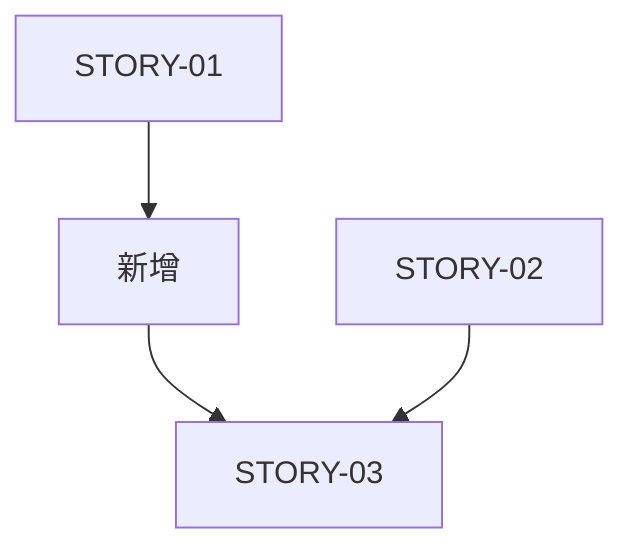

# 需求变更管理指南

当项目需求发生变化时，使用此 Prompt 评估影响并规划变更方案。

---

## 输入

用户需要提供：
1. **变更内容**：具体的需求变更描述
2. **受影响范围**：可能受影响的 Epic/Feature/Story ID（如果已知）
3. **变更原因**：为什么要变更（可选，但建议提供）

---

## 分析流程

### Step 1: 理解变更

首先理解变更的本质：
- **类型**：新增功能 / 修改功能 / 删除功能 / 优化改进
- **规模**：小改动 / 中等 / 大重构
- **紧急度**：常规迭代 / 紧急修复 / 战略调整

### Step 2: 影响范围分析

分析变更会影响哪些层级：

#### 2.1 Epic 层级影响
- 是否需要新增 Epic？
- 是否需要调整 Epic 的业务价值或范围？
- 现有 Epic 是否需要拆分或合并？

#### 2.2 Feature 层级影响
- 是否需要新增 Feature？
- 现有 Feature 的目标是否需要调整？
- Feature 之间的关系是否改变？

#### 2.3 Story 层级影响
- 哪些 Story 需要修改？（列出具体 ID）
- 哪些 Story 需要废弃？
- 是否需要新增 Story？
- Story 之间的依赖关系是否改变？

#### 2.4 Context 影响
- 哪些 Context 文档需要更新？
- 是否需要新增 Context？
- 技术方案是否有本质变化？

#### 2.5 已完成工作的影响
- 是否影响已完成的 Story（status: done）？
- 如果是，是否需要回退或重新测试？
- 已有代码是否需要重构？

---

## 输出格式

```markdown
# 需求变更影响分析

## 1. 变更概述

**变更内容**: {简要描述}
**变更类型**: {新增/修改/删除/优化}
**变更规模**: {小/中/大}
**变更原因**: {可选}

---

## 2. 影响范围

### 2.1 Epic 层级

| Epic ID | 影响类型 | 具体影响                 | 建议操作       |
| ------- | -------- | ------------------------ | -------------- |
| EPIC-01 | 修改范围 | 需要增加 XX 功能         | 更新 README.md |
| -       | 新增     | 需要新建 EPIC-03 处理 YY | 创建新 Epic    |

### 2.2 Feature 层级

| Feature ID | 影响类型 | 具体影响        | 建议操作       |
| ---------- | -------- | --------------- | -------------- |
| FEAT-01    | 修改目标 | 目标从 A 改为 B | 更新 README.md |

### 2.3 Story 层级

| Story ID | 当前状态 | 影响类型 | 建议操作                   |
| -------- | -------- | -------- | -------------------------- |
| STORY-01 | pending  | 废弃     | 标记为 cancelled，不再实现 |
| STORY-02 | done     | 需修改   | 创建 STORY-02.1 修复       |
| STORY-05 | pending  | 修改 BDD | 更新验收标准               |
| -        | -        | 新增     | 创建 STORY-08              |

### 2.4 依赖关系变化

**原依赖**:
```
STORY-01 → STORY-03
STORY-02 → STORY-03
```

**新依赖**:
```
STORY-01 → STORY-08 → STORY-03
STORY-02 → STORY-03
```

**Mermaid 依赖图**:


### 2.5 Context 影响

| Context 文件          | 影响类型 | 建议操作                        |
| --------------------- | -------- | ------------------------------- |
| Architecture.md       | 需更新   | 使用 @prompts/context/update.md |
| Module_Design_Core.md | 需废弃   | 标记 status: deprecated         |

---

## 3. 实施建议

### 方案 A: 渐进式变更（推荐）

**适用场景**: 变更规模中等，不影响已完成工作

**步骤**:
1. 更新 Context 文档
2. 修改/新增 Story
3. 更新依赖关系
4. 按新 Story 执行开发

**优点**: 风险小，已完成工作不受影响
**缺点**: 可能留下技术债

### 方案 B: 重构式变更

**适用场景**: 变更规模大，现有设计无法满足

**步骤**:
1. 创建新 Epic（如需要）
2. 重新设计 Features
3. 标记旧 Story 为 deprecated
4. 创建新 Story 体系
5. 逐步迁移

**优点**: 架构清晰，长期维护成本低
**缺点**: 短期成本高，可能影响进度

---

## 4. 风险评估

| 风险   | 影响       | 概率       | 应对措施 |
| ------ | ---------- | ---------- | -------- |
| {风险} | {高/中/低} | {高/中/低} | {措施}   |

---

## 5. Action Items

- [ ] 使用 @prompts/context/update.md 更新 {Context 文件}
- [ ] 更新 STORY-{ID} 的 BDD 场景
- [ ] 创建 STORY-{ID} 处理新需求
- [ ] 更新 EPIC-{ID}/README.md
- [ ] 通知团队成员变更内容
```

---

## 变更决策树

```
需求变更
  ├─ 影响已完成的 Story (status: done)?
  │   ├─ 是 → 创建 Bug Fix Story (STORY-XX.X)
  │   └─ 否 → 继续
  │
  ├─ 变更规模？
  │   ├─ 小 (<1 Story) → 直接修改现有 Story
  │   ├─ 中 (1-3 Story) → 新增 Story
  │   └─ 大 (>3 Story) → 考虑新增 Feature 或 Epic
  │
  └─ 架构是否改变？
      ├─ 是 → 更新 Context + 重新评审
      └─ 否 → 直接修改 Story
```

---

## 变更类型示例

### 示例 1: 小变更（修改验收标准）

**变更**: Story-03 的性能要求从"<100ms"改为"<50ms"

**分析**:
- 影响: STORY-03
- 操作: 更新 STORY-03 的 BDD 场景
- Context: 无需更新

### 示例 2: 中等变更（新增子功能）

**变更**: 用户登录需要增加"记住我"功能

**分析**:
- 影响: FEAT-01（用户认证）
- 操作: 新增 STORY-08（记住我功能）
- Context: 可能需要更新 Session_Management.md

### 示例 3: 大变更（架构调整）

**变更**: 从单体架构改为微服务架构

**分析**:
- 影响: 所有 Epic
- 操作: 
  - 创建 EPIC-XX（微服务改造）
  - 更新所有 Architecture Context
  - 重新评审所有 pending Story
- 建议: 使用 @prompts/planning/requirements_review.md 重新评审

---

## 变更后的验证

变更实施后，检查：

- [ ] 所有受影响的文档已更新
- [ ] 依赖关系图已更新
- [ ] Context 文档与实际一致
- [ ] 团队成员已知晓变更
- [ ] 变更已记录（Git commit message）

---

## 重要原则

1. **透明沟通**: 变更影响的所有人都应知晓
2. **渐进式优先**: 除非必要，避免大规模重构
3. **保留历史**: 废弃的 Story 保留但标记状态，不删除
4. **更新 Context**: Context 是真相源，必须保持最新
5. **重新评审**: 大变更需要重新走评审流程

---

现在，请提供需求变更的具体内容，我将帮您分析影响并给出建议。
