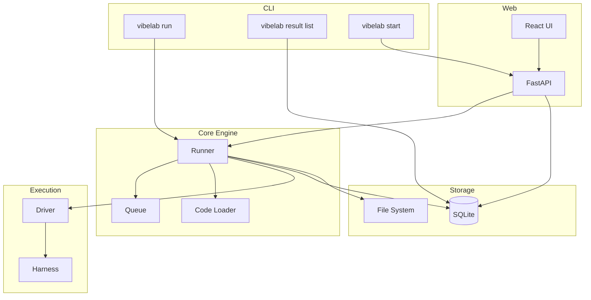
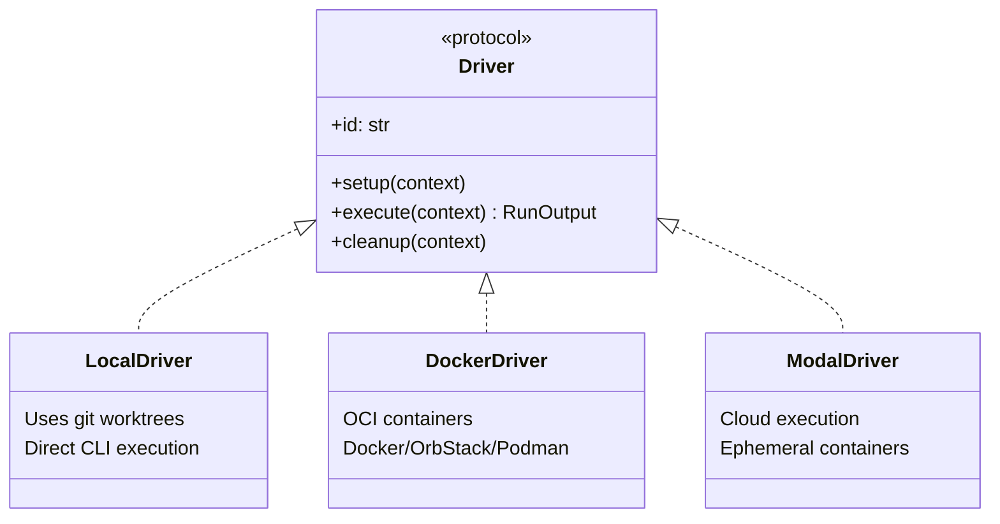
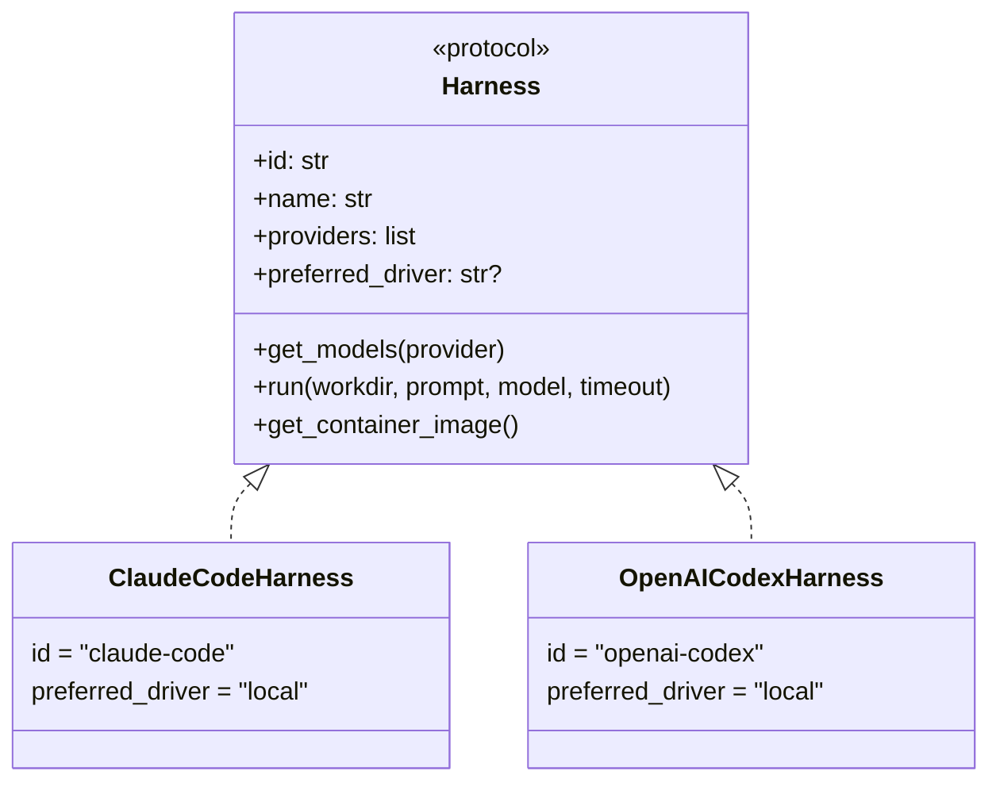

# VibeLab Implementation Plan

> A rigorous evaluation tool for comparing LLM coding agents.

**Note to Implementers:** This is a fresh implementation plan. The existing code in this repository (`llm_compare`) is a prototype used for exploration and learning. Use it as reference/inspiration, but implement VibeLab from scratch following this specification. The prototype demonstrates working patterns for harnesses, git worktrees, and the React UI that may be useful to review.

## Table of Contents

1. [Problem Statement](#problem-statement)
2. [Core Concepts](#core-concepts)
3. [Key Workflows](#key-workflows)
4. [Implementation Principles](#implementation-principles)
5. [Architecture Overview](#architecture-overview)
6. [MVP Scope](#mvp-scope)
7. [Data Model](#data-model)
8. [CLI Design](#cli-design)
9. [API Design](#api-design)
10. [UI Design](#ui-design)
11. [Driver & Harness Architecture](#driver--harness-architecture)
12. [Environment Variables](#environment-variables)
13. [Error Handling](#error-handling)
14. [Future Roadmap](#future-roadmap)
15. [Open Questions](#open-questions)

---

## Problem Statement

Software engineers increasingly use LLM agents (Claude Code, Codex, Cursor, Gemini CLI, etc.) to enhance development workflows. When new tools or models are released, engineers need a rigorous way to evaluate whether to adopt them—beyond "vibe checks."

**The core need:** A structured framework for running controlled experiments across different agent configurations and comparing their outputs systematically.

---

## Core Concepts

### Scenario

A specific task for an LLM agent, comprising:

| Component | Description | Extensibility |
|-----------|-------------|---------------|
| **Code** | Starting code state. Primary: GitHub URL + commit SHA | Future: local dirs, empty state, alternative sources |
| **Prompt** | User input specifying the task objective | Future: chat history, multi-media (images/video/audio) |
| **Tooling** | MCP servers, skills, rules available to the agent | Future: explicit tooling configuration (currently implicit via Code) |

Scenarios are the "rows" of an evaluation dataset—reusable across multiple runs for direct comparison.

### Executor

The specific agent configuration being evaluated:

| Component | Description |
|-----------|-------------|
| **Harness** | Agent executable (Claude Code, Codex, Cursor CLI, Gemini CLI) |
| **Provider** | Inference endpoint (typically maps to harness, but decoupled) |
| **Model** | Specific LLM model identifier |

Format: `harness:provider:model` (e.g., `claude-code:anthropic:sonnet`)

### Result

The output of running an Executor on a Scenario—the **primary record-keeping unit**:

| Category | Fields |
|----------|--------|
| **Code Output** | Final code state (git patch), most important artifact |
| **Logs** | stdout, stderr |
| **Primary Metrics** | Execution time |
| **Derived Metrics** | Lines added/removed, files changed |
| **Harness Metrics** | Tokens used, cost, tool calls, steps (when available) |
| **Harness Data** | Trajectory files, tool invocations (harness-specific) |
| **Annotations** | User-added notes, tags, scores (mutable) |

### Dataset

A named collection of Scenarios for batch evaluation and collective analysis:

| Component | Description |
|-----------|-------------|
| **Name** | Human-readable identifier |
| **Description** | Optional notes about the dataset |
| **Scenarios** | Many-to-many relationship via `dataset_scenarios` join table |

Datasets enable:
- **Batch Evaluation**: Run all scenarios in a dataset against multiple executors
- **Trials**: Run the same scenario-executor pair multiple times
- **Minimal Mode**: Only run missing scenario-executor pairs (skip already-completed)
- **Analytics**: Matrix view showing status across all scenario-executor combinations

### LLM Judge

An automatic grader that mimics human scores using few-shot examples:

| Component | Description |
|-----------|-------------|
| **LLMScenarioJudge** | Judge that applies to a single scenario |
| **Guidance** | User-authored instructions for the judge |
| **Training Samples** | Few-shot examples (result IDs) used to guide the judge |
| **Test Samples** | Samples (result IDs) used to calculate alignment with human scores |
| **Alignment Score** | Pearson correlation coefficient between judge and human quality scores |
| **Judgements** | LLM-generated notes and quality scores for results |

Judges evolve over time—new versions can be created with updated guidance or samples. When a run completes, the latest judge for that scenario automatically evaluates it and stores a judgement. Judges can also be retroactively applied to prior completed results.

---

## Key Workflows

### 1. Single Run
Run a scenario on one executor for 1-off analysis.

### 2. Comparative Run
Run a scenario on multiple executors for side-by-side comparison.

### 3. Trials
Run the same scenario+executor multiple times to observe non-deterministic behavior.

### 4. Batch Evaluation
Run executors against a dataset with options:
- **Trials**: Run each scenario-executor pair N times (default: 1)
- **Minimal Mode**: Only run pairs that don't have completed results (efficient for filling gaps)

---

## Implementation Principles

### Build Tool Preferences

| Domain | Tool | Notes |
|--------|------|-------|
| Python | `uv` | Package management, virtual envs |
| Python linting | `ruff` | Formatting and linting |
| TypeScript | `bun` | Runtime, package management |
| TypeScript linting | `oxc` | Fast linting |
| Build orchestration | `Makefile` | Standard commands |

### Makefile Commands

Every project should support these 5 commands:
- `fmt` - Format all code
- `lint` - Lint all code
- `check` - Type check all code
- `build` - Build all artifacts
- `test` - Run all tests

### Feature Development Layering

When adding any feature, follow this layered approach:

```
0. Tests        → Write tests first
1. DB           → Minimal schema changes if needed
2. Core Engine  → State management and data fetching
3. Library      → Expose as typed Python function
4. API          → Expose as FastAPI endpoint
5. CLI          → Expose as command-line interface
6. UI           → Expose in web interface
```

This ensures a well-architected, testable system with multiple access patterns (library, API, CLI, UI).

### Code Philosophy

- **KEEP IT MINIMAL** - Resist over-engineering
- **Focus on types & interfaces** - Well-defined contracts
- **Build for extension** - Consider future needs without implementing them
- **Don't pollute** - Keep evaluation data separate from target repositories

### Testing Strategy

- **Python**: pytest for unit and integration tests
- **TypeScript**: vitest or similar for component tests
- **E2E**: Playwright for full workflow testing
- Don't over-engineer, but ensure coverage of critical paths

---

## Architecture Overview



### Project Structure

```
vibelab/
├── Makefile
├── pyproject.toml
├── README.md
├── SPEC.md
├── PLAN.md
├── DEVELOPMENT.md
├── AGENTS.md
│
├── src/vibelab/
│   ├── models/          # Pydantic types
│   ├── db/              # SQLite + migrations
│   ├── engine/          # Runner, queue, code loader
│   ├── drivers/         # Execution environments
│   ├── harnesses/       # Agent implementations
│   ├── cli/             # Typer commands
│   ├── api/             # FastAPI routes
│   └── lib.py           # Public library interface
│
├── web/                 # React frontend
│   ├── src/
│   └── ...
│
└── tests/
    ├── unit/
    ├── integration/
    └── e2e/
```

### Storage Layout

```
~/.vibelab/                    # Configurable via VIBELAB_HOME
├── data.db                    # SQLite database
└── results/
    └── {result_id}/
        ├── patch.diff         # Git patch of changes
        ├── stdout.log
        ├── stderr.log
        └── harness/           # Harness-specific artifacts
            └── trajectory.json
```

---

## MVP Scope

### Recommended Implementation Order

1. **Project scaffolding**: `pyproject.toml`, `Makefile`, directory structure
2. **Models**: Pydantic types in `src/vibelab/models/`
3. **Database**: SQLite schema and migrations in `src/vibelab/db/`
4. **Core engine**: Runner, queue, code loader in `src/vibelab/engine/`
5. **Local driver**: Git worktree isolation in `src/vibelab/drivers/local.py`
6. **Harnesses**: Claude Code and OpenAI Codex in `src/vibelab/harnesses/`
7. **Library**: Public interface in `src/vibelab/lib.py`
8. **API**: FastAPI routes in `src/vibelab/api/`
9. **CLI**: Typer commands in `src/vibelab/cli/`
10. **Web UI**: React frontend in `web/`

### In Scope

- [ ] **`vibelab run`** - Execute scenario against executor(s), blocking
- [ ] **`vibelab scenario create`** - Explicitly create a scenario
- [ ] **`vibelab scenario list`** - List scenarios
- [ ] **`vibelab result list`** - List results with filtering
- [ ] **`vibelab result get`** - Get result details
- [ ] **`vibelab executor list`** - List available harness→provider→model tree
- [ ] **`vibelab start`** - Launch web UI and API server
- [ ] **Web UI** - Dashboard, run creation, scenario detail with comparison, result detail
- [ ] **Local driver** - Git worktree isolation
- [ ] **Two harnesses** - Claude Code, OpenAI Codex

### Out of Scope (Future)

- Export/import
- Screenshots
- Multi-media prompts
- MCP/tooling configuration
- Public hosting/leaderboard

### Implemented (Post-MVP)

- ✅ Real-time log streaming (SSE)
- ✅ Dataset batch evaluation with trials and minimal mode
- ✅ Docker driver
- ✅ Modal driver
- ✅ Cursor harness
- ✅ Gemini harness
- ✅ Real-time status polling
- ✅ Human notes and quality scores for results
- ✅ LLM Judges with few-shot prompting and alignment scoring
- ✅ Automatic judgement generation after run completion
- ✅ Judgements page for centralized view
- ✅ Accept judgements to copy LLM assessment to human feedback

---

## Data Model

### Scenario

| Field | Type | Description |
|-------|------|-------------|
| `id` | int | Primary key |
| `code_type` | enum | `github`, `local`, `empty` |
| `code_ref` | json | Type-specific reference data |
| `prompt` | text | Task description |
| `created_at` | datetime | Creation timestamp |

### Result

| Field | Type | Mutable | Description |
|-------|------|---------|-------------|
| `id` | int | No | Primary key |
| `scenario_id` | int | No | Foreign key to scenario |
| `harness` | string | No | Harness identifier |
| `provider` | string | No | Provider identifier |
| `model` | string | No | Model identifier |
| `status` | enum | No | `queued`, `running`, `completed`, `failed`, `timeout` |
| `created_at` | datetime | No | When queued |
| `updated_at` | datetime | No | When last modified (for polling) |
| `started_at` | datetime | No | When execution began |
| `finished_at` | datetime | No | When execution ended |
| `duration_ms` | int | No | Execution duration |
| `lines_added` | int | No | Lines added |
| `lines_removed` | int | No | Lines removed |
| `files_changed` | int | No | Files modified |
| `tokens_used` | int | No | Token count (if available) |
| `cost_usd` | float | No | Cost estimate (if available) |
| `harness_metrics` | json | No | Harness-specific metrics |
| `annotations` | json | **Yes** | User notes, tags, scores |
| `notes` | text | **Yes** | Human notes about the run |
| `quality` | int | **Yes** | Quality score: 4=Perfect, 3=Good, 2=Workable, 1=Bad |

### LLMScenarioJudge

| Field | Type | Description |
|-------|------|-------------|
| `id` | int | Primary key |
| `scenario_id` | int | Foreign key to scenario |
| `guidance` | text | User-authored instructions for the judge |
| `training_sample_ids` | json | List of result IDs used as few-shot examples |
| `test_sample_ids` | json | List of result IDs used for alignment calculation |
| `alignment_score` | float | Pearson correlation with human scores (null if not trained) |
| `created_at` | datetime | Creation timestamp |

### Judgement

| Field | Type | Description |
|-------|------|-------------|
| `id` | int | Primary key |
| `result_id` | int | Foreign key to result |
| `judge_id` | int | Foreign key to LLMScenarioJudge |
| `notes` | text | LLM-generated notes |
| `quality` | int | LLM-generated quality score (1-4) |
| `created_at` | datetime | Creation timestamp |

### Example Pydantic Models

```python
from datetime import datetime
from enum import Enum
from pydantic import BaseModel

class CodeType(str, Enum):
    GITHUB = "github"
    LOCAL = "local"
    EMPTY = "empty"

class GitHubCodeRef(BaseModel):
    """Reference to a GitHub repository."""
    owner: str
    repo: str
    commit_sha: str
    branch: str | None = None

class LocalCodeRef(BaseModel):
    """Reference to a local directory."""
    path: str

class Scenario(BaseModel):
    """A specific task for an LLM agent."""
    id: int
    code_type: CodeType
    code_ref: GitHubCodeRef | LocalCodeRef | None
    prompt: str
    created_at: datetime

class ResultStatus(str, Enum):
    QUEUED = "queued"
    RUNNING = "running"
    COMPLETED = "completed"
    FAILED = "failed"
    TIMEOUT = "timeout"

class Result(BaseModel):
    """Output of running an executor on a scenario."""
    id: int
    scenario_id: int
    harness: str
    provider: str
    model: str
    status: ResultStatus
    created_at: datetime
    updated_at: datetime | None = None  # Updated on every status/metric change
    started_at: datetime | None = None
    finished_at: datetime | None = None
    duration_ms: int | None = None
    lines_added: int | None = None
    lines_removed: int | None = None
    files_changed: int | None = None
    tokens_used: int | None = None
    cost_usd: float | None = None
    harness_metrics: dict | None = None
    annotations: dict | None = None
    notes: str | None = None
    quality: int | None = None  # 4=Perfect, 3=Good, 2=Workable, 1=Bad
    
    def is_stale(self) -> bool:
        """Check if running result has exceeded its timeout."""
        if self.status != ResultStatus.RUNNING:
            return False
        if not self.started_at or not self.timeout_seconds:
            return False
        elapsed = (datetime.now() - self.started_at).total_seconds()
        return elapsed > self.timeout_seconds

class Annotations(BaseModel):
    """User-added annotations for a result."""
    notes: str | None = None
    tags: list[str] = []
    score: int | None = None  # 1-5 rating
    passed: bool | None = None  # Manual pass/fail

class Dataset(BaseModel):
    """A collection of scenarios for batch evaluation."""
    id: int
    name: str
    description: str | None = None
    created_at: datetime
```

### Database Schema

```sql
-- Schema version tracking
CREATE TABLE schema_version (
    version INTEGER PRIMARY KEY,
    applied_at TEXT NOT NULL DEFAULT CURRENT_TIMESTAMP
);

-- Scenarios table
CREATE TABLE scenarios (
    id INTEGER PRIMARY KEY AUTOINCREMENT,
    code_type TEXT NOT NULL CHECK (code_type IN ('github', 'local', 'empty')),
    code_ref TEXT,  -- JSON
    prompt TEXT NOT NULL,
    created_at TEXT NOT NULL DEFAULT CURRENT_TIMESTAMP
);

-- Datasets table
CREATE TABLE datasets (
    id INTEGER PRIMARY KEY AUTOINCREMENT,
    name TEXT NOT NULL,
    description TEXT,
    created_at TEXT NOT NULL DEFAULT CURRENT_TIMESTAMP
);

-- Dataset-Scenario join table (many-to-many)
CREATE TABLE dataset_scenarios (
    dataset_id INTEGER NOT NULL REFERENCES datasets(id) ON DELETE CASCADE,
    scenario_id INTEGER NOT NULL REFERENCES scenarios(id) ON DELETE CASCADE,
    PRIMARY KEY (dataset_id, scenario_id)
);

-- Results table
CREATE TABLE results (
    id INTEGER PRIMARY KEY AUTOINCREMENT,
    scenario_id INTEGER NOT NULL REFERENCES scenarios(id),
    harness TEXT NOT NULL,
    provider TEXT NOT NULL,
    model TEXT NOT NULL,
    status TEXT NOT NULL DEFAULT 'queued'
        CHECK (status IN ('queued', 'running', 'completed', 'failed', 'timeout')),
    created_at TEXT NOT NULL DEFAULT CURRENT_TIMESTAMP,
    updated_at TEXT,  -- Updated on every status/metric change (for polling)
    started_at TEXT,
    finished_at TEXT,
    duration_ms INTEGER,
    lines_added INTEGER,
    lines_removed INTEGER,
    files_changed INTEGER,
    tokens_used INTEGER,
    cost_usd REAL,
    harness_metrics TEXT,  -- JSON
    annotations TEXT,  -- JSON, mutable
    timeout_seconds INTEGER,
    driver TEXT DEFAULT 'local',
    notes TEXT,  -- Mutable: Human notes about the run
    quality INTEGER CHECK (quality IS NULL OR (quality >= 1 AND quality <= 4))  -- Mutable: Quality score
);

CREATE INDEX idx_results_scenario ON results(scenario_id);
CREATE INDEX idx_results_status ON results(status);

-- LLM Scenario Judges table
CREATE TABLE llm_scenario_judges (
    id INTEGER PRIMARY KEY AUTOINCREMENT,
    scenario_id INTEGER NOT NULL REFERENCES scenarios(id) ON DELETE CASCADE,
    guidance TEXT NOT NULL,
    training_sample_ids TEXT,  -- JSON list of result IDs
    test_sample_ids TEXT,      -- JSON list of result IDs
    alignment_score REAL,
    created_at TEXT NOT NULL DEFAULT CURRENT_TIMESTAMP
);
CREATE INDEX idx_llm_scenario_judges_scenario ON llm_scenario_judges(scenario_id);

-- Judgements table
CREATE TABLE judgements (
    id INTEGER PRIMARY KEY AUTOINCREMENT,
    result_id INTEGER NOT NULL REFERENCES results(id) ON DELETE CASCADE,
    judge_id INTEGER NOT NULL REFERENCES llm_scenario_judges(id) ON DELETE CASCADE,
    notes TEXT,
    quality INTEGER CHECK (quality IS NULL OR (quality >= 1 AND quality <= 4)),
    created_at TEXT NOT NULL DEFAULT CURRENT_TIMESTAMP,
    UNIQUE(result_id, judge_id)
);
CREATE INDEX idx_judgements_result ON judgements(result_id);
CREATE INDEX idx_judgements_judge ON judgements(judge_id);
```

### Database Migrations

- Schema includes version table
- On startup, check version and apply pending migrations
- Users can upgrade without manual database management

```python
# Example migration system
MIGRATIONS = [
    # Version 1: Initial schema
    """
    CREATE TABLE schema_version (...);
    CREATE TABLE scenarios (...);
    CREATE TABLE results (...);
    """,
    # Version 2: Add index
    """
    CREATE INDEX idx_results_harness ON results(harness);
    """,
]

def migrate(db: sqlite3.Connection) -> None:
    """Apply pending migrations."""
    current = get_schema_version(db)
    for version, sql in enumerate(MIGRATIONS, start=1):
        if version > current:
            db.executescript(sql)
            db.execute("INSERT INTO schema_version (version) VALUES (?)", (version,))
    db.commit()
```

---

## CLI Design

### `vibelab run`

```bash
vibelab run \
  --code github:owner/repo@sha \
  --prompt "Fix the authentication bug" \
  --executor claude-code:anthropic:sonnet \
  --executor openai-codex:openai:gpt-4o \
  --timeout 1800 \
  --driver local
```

- Creates scenario if code+prompt doesn't exist
- Runs executors **sequentially** (queued)
- Blocks until complete
- Outputs JSON result summary
- Warns but continues if a harness is unavailable

### `vibelab scenario`

```bash
vibelab scenario create --code <REF> --prompt <TEXT>
vibelab scenario list [--limit N]
vibelab scenario get <ID>
```

### `vibelab result`

```bash
vibelab result list [--scenario ID] [--executor SPEC] [--status STATUS]
vibelab result get <ID>
vibelab result diff <ID>
vibelab result update-notes <ID> [--notes TEXT] [--clear]
vibelab result update-quality <ID> [--quality 1-4] [--clear]
vibelab result update <ID> [--notes TEXT] [--quality 1-4] [--clear-notes] [--clear-quality]
```

**Update commands:**
- `update-notes`: Add or update notes for a result. Use `--notes "-"` to read from stdin, or `--clear` to remove notes.
- `update-quality`: Set quality score (1=Bad, 2=Workable, 3=Good, 4=Perfect). Use `--clear` to remove score.
- `update`: Update both notes and quality in one command.

Output format: JSONL for `list`, JSON for `get`

### `vibelab executor`

```bash
vibelab executor list
vibelab executor list --harness claude-code
vibelab executor list --harness claude-code --provider anthropic
```

Returns hierarchical tree: harness → provider → model

### `vibelab dataset`

```bash
vibelab dataset create --name <NAME> [--description <TEXT>]
vibelab dataset list [--limit N]
vibelab dataset get <ID>
vibelab dataset delete <ID>
vibelab dataset add-scenario --dataset <ID> --scenario <ID>
vibelab dataset remove-scenario --dataset <ID> --scenario <ID>
vibelab dataset run --dataset <ID> --executor <SPEC> [--trials N] [--minimal] [--timeout SEC] [--driver DRIVER]
```

**Options:**
- `--trials`: Number of runs per scenario-executor pair (default: 1)
- `--minimal`: Only run scenario-executor pairs that don't have completed results
- `--executor`: Agent specification as `harness:provider:model` (can be repeated)

### `vibelab start`

```bash
vibelab start [--port 8000] [--host 127.0.0.1]
```

Launches FastAPI server + serves React UI.

---

## API Design

### Endpoints

| Method | Path | Description |
|--------|------|-------------|
| **Scenarios** | | |
| `GET` | `/api/scenarios` | List scenarios |
| `GET` | `/api/scenarios/{id}` | Get scenario with results |
| `POST` | `/api/scenarios` | Create scenario |
| **Results** | | |
| `GET` | `/api/results` | List results (filterable) |
| `GET` | `/api/results/{id}` | Get result detail |
| `GET` | `/api/results/{id}/patch` | Get diff patch |
| `GET` | `/api/results/{id}/logs` | Get stdout/stderr |
| `PATCH` | `/api/results/{id}/annotations` | Update annotations |
| `PATCH` | `/api/results/{id}/notes` | Update notes |
| `PATCH` | `/api/results/{id}/quality` | Update quality score |
| `PATCH` | `/api/results/{id}/notes-quality` | Update notes and quality |
| **Runs** | | |
| `POST` | `/api/runs` | Queue new run |
| **Judges** | | |
| `GET` | `/api/judges` | List judges (optionally filtered by scenario_id) |
| `GET` | `/api/judges/{id}` | Get judge details |
| `POST` | `/api/judges` | Create new judge |
| `PUT` | `/api/judges/{id}` | Update judge (creates new version) |
| `POST` | `/api/judges/{id}/train` | Train judge and calculate alignment |
| `DELETE` | `/api/judges/{id}` | Delete judge |
| `GET` | `/api/judges/{id}/judgements` | List judgements for a judge |
| `POST` | `/api/judges/{id}/judge-result/{result_id}` | Manually trigger judgement for a result |
| `POST` | `/api/judges/{id}/apply` | Apply judge to multiple results |
| `GET` | `/api/judges/{id}/pending-judgements` | List completed results without judgements |
| `GET` | `/api/judges/scenarios/{scenario_id}/judgements` | List all judgements for a scenario |
| `POST` | `/api/judges/judgements/{judgement_id}/accept` | Accept judgement (copy to human feedback) |
| **Datasets** | | |
| `GET` | `/api/datasets` | List datasets |
| `GET` | `/api/datasets/{id}` | Get dataset with scenarios |
| `POST` | `/api/datasets` | Create dataset |
| `DELETE` | `/api/datasets/{id}` | Delete dataset |
| `POST` | `/api/datasets/{id}/scenarios` | Add scenario to dataset |
| `DELETE` | `/api/datasets/{id}/scenarios/{scenario_id}` | Remove scenario from dataset |
| `POST` | `/api/datasets/{id}/runs` | Queue runs for all scenarios in dataset |
| `GET` | `/api/datasets/{id}/analytics` | Get scenario-executor matrix analytics |
| **Executors** | | |
| `GET` | `/api/executors` | List harnesses |
| `GET` | `/api/executors/{harness}` | List providers |
| `GET` | `/api/executors/{harness}/{provider}` | List models |
| **Streaming** | | |
| `GET` | `/api/results/{id}/stream` | SSE stream for real-time logs |
| `GET` | `/api/results/{id}/stream/status` | Get current stream status |

### Real-time Status Updates

VibeLab uses a hybrid approach for real-time updates:

1. **Server-Sent Events (SSE)** for streaming logs during execution
2. **Polling** for status updates on list/detail pages

#### Architecture

```
┌─────────────────────────────────────────────────────────────────────┐
│                           Frontend (React)                          │
├─────────────────────────────────────────────────────────────────────┤
│  TanStack Query with refetchInterval:                               │
│  - Checks if any results are running/queued                         │
│  - If yes: poll every 2-3 seconds                                   │
│  - If no: stop polling (saves resources)                            │
│                                                                     │
│  For running results:                                               │
│  - Uses SSE streaming for real-time logs                            │
│  - Polls API for status updates (backup)                            │
└──────────────────────────────────┬──────────────────────────────────┘
                                   │
                                   ▼
┌─────────────────────────────────────────────────────────────────────┐
│                          Backend (FastAPI)                          │
├─────────────────────────────────────────────────────────────────────┤
│  API Endpoints:                                                     │
│  - GET /results - returns list with is_stale computed               │
│  - GET /results/{id} - returns single result with is_stale          │
│  - GET /results/{id}/stream - SSE for real-time logs                │
│                                                                     │
│  Background Tasks:                                                  │
│  - Update DB status as runs progress                                │
│  - Update streaming files for SSE                                   │
│  - Update updated_at on every status change                         │
└──────────────────────────────────┬──────────────────────────────────┘
                                   │
                                   ▼
┌─────────────────────────────────────────────────────────────────────┐
│                         Database (SQLite)                           │
├─────────────────────────────────────────────────────────────────────┤
│  Results table with:                                                │
│  - status (queued/running/completed/failed/timeout)                 │
│  - updated_at (timestamp of last change)                            │
│  - is_stale() computed at runtime                                   │
└─────────────────────────────────────────────────────────────────────┘
```

#### SSE Events

The `/api/results/{id}/stream` endpoint emits:

| Event | Description |
|-------|-------------|
| `connected` | Initial connection established |
| `status` | Status update (queued/running/completed/failed) |
| `output` | New log output (incremental) |
| `patch` | Git diff update |
| `done` | Stream finished |
| `error` | Error occurred |

#### Polling Strategy

Frontend components use conditional polling:

```typescript
useQuery({
  queryKey: ['results'],
  queryFn: listResults,
  refetchInterval: (query) => {
    const hasRunning = query.state.data?.some(
      r => r.status === 'running' || r.status === 'queued'
    )
    return hasRunning ? 3000 : false  // Poll or stop
  },
})
```

#### Stale Result Detection

Results are marked as "stale" if they've been running longer than their timeout:

```python
def is_stale(self) -> bool:
    if self.status != ResultStatus.RUNNING:
        return False
    if not self.started_at or not self.timeout_seconds:
        return False
    elapsed = (now - self.started_at).total_seconds()
    return elapsed > self.timeout_seconds
```

The API includes `is_stale: bool` in all result responses for UI display.

---

## UI Design

### Routes

| Path | Description |
|------|-------------|
| `/` | Dashboard - recent scenarios, quick actions |
| `/scenarios` | Table view of all scenarios |
| `/runs` | Table view of all runs across scenarios |
| `/executors` | Single table view of all executor tuples (harness:provider:model) with filtering and selection |
| `/run/create` | Form to create and launch a run (supports `?scenario=X` to pre-fill scenario, `?executors=spec1,spec2` to pre-fill executors) |
| `/runs` | Table view of all runs (supports `?executor=spec` to filter by executor) |
| `/scenario/{id}` | Scenario detail with results table, judge management, and judgements |
| `/result/{id}` | Single result detail with human feedback and LLM judge judgements |
| `/compare` | Side-by-side comparison of selected results |
| `/judgements` | All judgements and pending judgements across scenarios |

### Scenario Detail View

Two tabs:

1. **Details Tab** (default)
   - Scenario prompt and code reference
   - All results in a sortable table
   - Shows: executor, status, duration, lines changed, files changed, cost, human quality, judge quality
   - Checkboxes to select results for comparison
   - Click to view individual result details
   - Judgements from older judge versions are shown but marked as "outdated"

2. **Judge Tab**
   - LLM Judge information and management
   - Shows: alignment score, training/test sample counts, guidance
   - "Create Judge" / "Update Judge" buttons to manage judge configuration
   - "Apply to All Results" button to retroactively judge prior runs
   - List of judgements made by this judge

### Result Detail View

- **Code Output**: Diff viewer with syntax highlighting
- **Logs**: stdout/stderr viewer with streaming support
- **Metrics**: Duration, lines changed, tokens, cost
- **Human Notes & Quality**: Editable notes and quality score (1-4)
- **LLM Judge Judgement**: Shows judge assessment with alignment score
  - "Accept" button to copy judge's notes and quality to human feedback
  - Outdated badge if judgement is from older judge version

### Judgements Page

- **Completed Judgements**: Table of all judgements across scenarios
  - Shows: result, scenario, judge, executor, judge quality, human quality, alignment
- **In Progress**: Results waiting for judgements
  - Running/queued results that will be judged on completion
  - Completed results without judgements from any judge

### Design Principles

- Dark theme, developer-oriented aesthetic
- Monospace fonts for code/technical content
- Minimal, functional UI
- Fast navigation between scenarios and results
- **Table/list views preferred**: Use tables for displaying lists of data (scenarios, runs, executors, results) rather than card/tile layouts for better data scanning and comparison

---

## Driver & Harness Architecture

### Driver Protocol

Drivers manage execution environments and isolation:



#### Example Driver Protocol

```python
from typing import Protocol
from pathlib import Path
from dataclasses import dataclass

@dataclass
class ExecutionContext:
    """Context passed to driver methods."""
    result_id: str
    scenario: Scenario
    harness: "Harness"
    provider: str
    model: str
    timeout_seconds: int
    workdir: Path  # Set by driver.setup()

@dataclass
class RunOutput:
    """Output from driver execution."""
    exit_code: int
    stdout: str
    stderr: str
    duration_ms: int
    patch: str | None  # Git diff of changes

class Driver(Protocol):
    """Protocol for execution environment drivers."""

    @property
    def id(self) -> str:
        """Unique driver identifier."""
        ...

    def setup(self, ctx: ExecutionContext) -> None:
        """
        Prepare execution environment.

        For LocalDriver: Create git worktree from source repo
        For DockerDriver: Pull image, create container
        For ModalDriver: Provision cloud sandbox

        Must set ctx.workdir to the prepared working directory.
        """
        ...

    def execute(self, ctx: ExecutionContext) -> RunOutput:
        """
        Run the harness in the prepared environment.

        Should capture stdout/stderr, measure duration, and
        generate git patch of any changes made.
        """
        ...

    def cleanup(self, ctx: ExecutionContext) -> None:
        """
        Clean up execution environment.

        For LocalDriver: Remove git worktree
        For DockerDriver: Remove container
        For ModalDriver: Terminate sandbox
        """
        ...
```

#### Local Driver Implementation Notes

The local driver uses git worktrees for isolation:

```bash
# Setup: Create isolated worktree
git worktree add /tmp/vibelab/{result_id} -b vibelab-{result_id} {commit_sha}

# Execute: Run harness CLI in worktree directory
cd /tmp/vibelab/{result_id}
claude --print --output-format stream-json -p "{prompt}"

# Capture changes as patch
git diff HEAD > patch.diff

# Cleanup: Remove worktree
git worktree remove /tmp/vibelab/{result_id} --force
```

### Harness Protocol

Harnesses implement agent-specific execution:



#### Example Harness Protocol

```python
from typing import Protocol
from pathlib import Path
from dataclasses import dataclass

@dataclass
class HarnessOutput:
    """Output from harness execution."""
    exit_code: int
    stdout: str
    stderr: str
    # Harness-specific metrics (tokens, cost, etc.)
    metrics: dict[str, any] | None = None
    # Path to trajectory/conversation file if available
    trajectory_path: Path | None = None

class Harness(Protocol):
    """Protocol for agent harness implementations."""

    @property
    def id(self) -> str:
        """Unique harness identifier (e.g., 'claude-code')."""
        ...

    @property
    def name(self) -> str:
        """Human-readable name (e.g., 'Claude Code')."""
        ...

    @property
    def supported_providers(self) -> list[str]:
        """List of provider IDs this harness supports."""
        ...

    @property
    def preferred_driver(self) -> str | None:
        """
        Preferred driver ID, or None for system default.

        Harness authors can specify a preferred driver if their
        harness requires specific dependencies or isolation.
        """
        ...

    def get_models(self, provider: str) -> list[ModelInfo]:
        """Get available models for a provider."""
        ...

    def check_available(self) -> tuple[bool, str | None]:
        """
        Check if harness is available (CLI installed, etc.).

        Returns (is_available, error_message_if_not).
        """
        ...

    def run(
        self,
        workdir: Path,
        prompt: str,
        provider: str,
        model: str,
        timeout_seconds: int,
    ) -> HarnessOutput:
        """
        Execute the agent with the given prompt.

        The harness should:
        1. Construct the appropriate CLI command
        2. Execute in the provided workdir
        3. Capture output and metrics
        4. Return structured output
        """
        ...

    def get_container_image(self) -> str | None:
        """
        Return container image for Docker/Modal drivers.

        Returns None if harness doesn't support containerized execution.
        """
        ...
```

#### Example Harness Implementations

```python
class ClaudeCodeHarness:
    """Harness for Claude Code CLI."""

    id = "claude-code"
    name = "Claude Code"
    supported_providers = ["anthropic"]
    preferred_driver = None  # Works with any driver

    def get_models(self, provider: str) -> list[ModelInfo]:
        return [
            ModelInfo(id="opus", name="Claude Opus 4"),
            ModelInfo(id="sonnet", name="Claude Sonnet 4"),
            ModelInfo(id="haiku", name="Claude Haiku 3.5"),
        ]

    def check_available(self) -> tuple[bool, str | None]:
        # Check if 'claude' CLI is installed
        result = subprocess.run(["which", "claude"], capture_output=True)
        if result.returncode != 0:
            return False, "Claude Code CLI not found. Install: npm install -g @anthropic-ai/claude-code"
        return True, None

    def run(self, workdir: Path, prompt: str, provider: str, model: str, timeout_seconds: int) -> HarnessOutput:
        cmd = [
            "claude",
            "--print",
            "--output-format", "stream-json",
            "--model", model,
            "-p", prompt,
        ]
        # Execute and capture output...


class OpenAICodexHarness:
    """Harness for OpenAI Codex CLI."""

    id = "openai-codex"
    name = "OpenAI Codex"
    supported_providers = ["openai"]
    preferred_driver = None

    def get_models(self, provider: str) -> list[ModelInfo]:
        return [
            ModelInfo(id="gpt-4o", name="GPT-4o"),
            ModelInfo(id="o3", name="o3"),
            ModelInfo(id="o4-mini", name="o4-mini"),
        ]

    def check_available(self) -> tuple[bool, str | None]:
        result = subprocess.run(["which", "codex"], capture_output=True)
        if result.returncode != 0:
            return False, "Codex CLI not found. Install: npm install -g @openai/codex"
        return True, None

    def run(self, workdir: Path, prompt: str, provider: str, model: str, timeout_seconds: int) -> HarnessOutput:
        cmd = [
            "codex",
            "--model", model,
            "--approval-mode", "full-auto",
            prompt,
        ]
        # Execute and capture output...
```

### Driver Selection

Order of precedence:
1. CLI flag: `--driver local|docker`
2. Harness preference: `harness.preferred_driver`
3. Environment: `VIBELAB_DRIVER`
4. Default: `local`

This allows harness authors to specify their preferred execution environment (e.g., a harness that requires specific dependencies might prefer `docker`), while users can override.

### OCI Runtime Selection (Docker Driver)

1. Environment: `VIBELAB_OCI_RUNTIME`
2. Auto-detect: docker → orbstack → podman

### Adding New Harnesses

Harnesses are pluggable. To add a new harness:

1. Implement the `Harness` protocol
2. Register in harness registry
3. Optionally specify `preferred_driver` and `get_container_image()`

Example harnesses to add post-MVP:
- Cursor CLI
- Gemini CLI
- Aider
- Continue

---

## Environment Variables

| Variable | Default | Description |
|----------|---------|-------------|
| `VIBELAB_HOME` | `~/.vibelab` | Base directory for data storage |
| `VIBELAB_DRIVER` | `local` | Default execution driver |
| `VIBELAB_OCI_RUNTIME` | auto-detect | OCI runtime for docker driver |
| `VIBELAB_LOG_LEVEL` | `INFO` | Logging verbosity |
| `VIBELAB_TIMEOUT` | `1800` | Default timeout in seconds |

Agent-specific API keys should be configured per their documentation:
- Claude Code: `ANTHROPIC_API_KEY`
- OpenAI Codex: `OPENAI_API_KEY`

---

## Error Handling

### Harness Availability

When a harness is unavailable (CLI not installed, missing API key):
- Log a warning with installation instructions
- Skip that executor, continue with others
- Include skip reason in CLI output
- Never fail the entire run due to one unavailable harness

```python
# Example handling
for executor in executors:
    harness = get_harness(executor.harness)
    available, error = harness.check_available()
    if not available:
        logger.warning(f"Skipping {executor}: {error}")
        continue
    # Proceed with execution
```

### Execution Failures

| Failure Type | Handling |
|--------------|----------|
| Timeout | Mark result as `timeout`, capture partial output |
| Non-zero exit | Mark result as `failed`, capture error output |
| Exception | Mark result as `failed`, log stack trace |
| Git clone fail | Fail fast, report clear error about repository access |

### Cleanup Guarantees

Drivers must clean up resources even on failure:
- Use try/finally or context managers
- Git worktrees removed after execution
- Containers stopped and removed
- Temporary files cleaned up

```python
# Example cleanup pattern
try:
    driver.setup(ctx)
    output = driver.execute(ctx)
finally:
    driver.cleanup(ctx)
```

---

## Future Roadmap

### Completed
- ✅ Real-time log streaming via SSE
- ✅ Docker driver implementation
- ✅ Modal driver for cloud execution
- ✅ Additional harnesses (Cursor, Gemini)
- ✅ Real-time status polling architecture

### Near-term
- Dataset batch evaluation
- Result export/import for sharing
- Improved feedback system (scores, notes, pass/fail)

### Medium-term
- Post-hoc test execution
- Screenshot capture for UI changes
- Container specification per scenario

### Long-term
- MCP/tooling configuration
- Multi-media prompt support
- Public leaderboard hosting
- Cloud-hosted service

---

## Open Questions

Decisions deferred for later:

1. **Tooling configuration** - How to explicitly specify MCP servers, skills, rules? Currently implicit via code state.

2. **Prompt files** - Support `--prompt-file` for large prompts or prompt templates?

3. **Deduplication** - Should scenarios be deduplicated by content hash, or always create new?

4. **Container images** - Who builds/hosts harness container images?

5. **Authentication** - Needed for future multi-user or hosted scenarios?

6. **Webhooks** - Notify on run completion for CI/CD integration?

7. **Workspace cleanup policy** - Keep last N results? Manual cleanup command? Configurable TTL?

---

## Documentation Files

| File | Purpose | Audience |
|------|---------|----------|
| `README.md` | Project overview, installation, basic usage | Users |
| `SPEC.md` | Product requirements (terse, accurate) | Product decisions |
| `PLAN.md` | Implementation plan (this file) | Implementers |
| `DEVELOPMENT.md` | Developer setup, contribution guide | Contributors |
| `AGENTS.md` | LLM-specific coding instructions | AI agents working on codebase |

Keep SPEC.md focused on **what** we're building. Keep implementation details in code comments and DEVELOPMENT.md.
