# Excel2Spec MVP タスク一覧

**Version**: 1.0
**Last Updated**: 2025-12-12
**Sprint**: MVP (v0.1)

---

## タスク概要

| カテゴリ | タスク数 | 見積もり |
|---------|---------|---------|
| プロジェクト設定 | 3 | 1時間 |
| Domain層 | 2 | 1時間 |
| Infrastructure層 | 4 | 3時間 |
| Application層 | 1 | 1時間 |
| Presentation層 | 3 | 2時間 |
| テスト | 3 | 2時間 |
| **合計** | **16** | **10時間** |

---

## 1. プロジェクト設定

### TASK-001: プロジェクト初期化
**優先度**: P0 (必須)
**見積もり**: 20分
**依存**: なし

**内容**:
- [ ] pyproject.toml 作成
- [ ] src/excel2spec/ ディレクトリ構造作成
- [ ] __init__.py ファイル作成
- [ ] .gitignore 更新

**受け入れ条件**:
- `pip install -e .` でインストール可能
- `python -c "import excel2spec"` が成功

---

### TASK-002: 開発環境設定
**優先度**: P0 (必須)
**見積もり**: 20分
**依存**: TASK-001

**内容**:
- [ ] ruff 設定追加
- [ ] mypy 設定追加
- [ ] pytest 設定追加
- [ ] pre-commit 設定（オプション）

**受け入れ条件**:
- `ruff check src/` が実行可能
- `mypy src/` が実行可能
- `pytest` が実行可能

---

### TASK-003: 依存関係インストール
**優先度**: P0 (必須)
**見積もり**: 10分
**依存**: TASK-001

**内容**:
- [ ] typer, rich インストール確認
- [ ] xlrd, openpyxl インストール確認
- [ ] oletools インストール確認
- [ ] pytest, mypy, ruff インストール確認

**受け入れ条件**:
- すべての依存関係がインポート可能

---

## 2. Domain層

### TASK-101: ドメインモデル実装
**優先度**: P0 (必須)
**見積もり**: 30分
**依存**: TASK-001

**内容**:
- [ ] ModuleType enum 作成
- [ ] ProcedureType enum 作成
- [ ] Variable dataclass 作成
- [ ] Procedure dataclass 作成
- [ ] Module dataclass 作成
- [ ] VbaProject dataclass 作成
- [ ] Workbook dataclass 作成

**ファイル**: `src/excel2spec/domain/models.py`

**受け入れ条件**:
- すべてのモデルがインスタンス化可能
- 型ヒントが正しく定義されている

---

### TASK-102: カスタム例外クラス実装
**優先度**: P1 (高)
**見積もり**: 15分
**依存**: TASK-001

**内容**:
- [ ] Excel2SpecError 基底クラス
- [ ] FileNotFoundError
- [ ] UnsupportedFormatError
- [ ] VbaExtractionError
- [ ] VbaProtectedError
- [ ] ParseError

**ファイル**: `src/excel2spec/domain/exceptions.py`

**受け入れ条件**:
- すべての例外が raise 可能
- 適切なエラーメッセージを持つ

---

## 3. Infrastructure層

### TASK-201: Excel Reader実装
**優先度**: P0 (必須)
**見積もり**: 45分
**依存**: TASK-101

**内容**:
- [ ] ExcelReader クラス作成
- [ ] xls読み込み（xlrd）実装
- [ ] xlsx/xlsm読み込み（openpyxl）実装
- [ ] ファイル形式判定ロジック
- [ ] エラーハンドリング

**ファイル**: `src/excel2spec/infrastructure/readers/excel_reader.py`

**受け入れ条件**:
- xls, xlsx, xlsm ファイルを読み込める
- シート名一覧を取得できる
- 存在しないファイルで適切なエラー

---

### TASK-202: VBA Extractor実装
**優先度**: P0 (必須)
**見積もり**: 45分
**依存**: TASK-101

**内容**:
- [ ] VbaExtractor クラス作成
- [ ] oletools による VBA抽出実装
- [ ] モジュール種別判定ロジック
- [ ] パスワード保護検出
- [ ] エラーハンドリング

**ファイル**: `src/excel2spec/infrastructure/extractors/vba_extractor.py`

**受け入れ条件**:
- xls, xlsm からVBAコードを抽出できる
- モジュール名と種別を取得できる
- VBA保護を検出できる

---

### TASK-203: VBA Parser実装
**優先度**: P0 (必須)
**見積もり**: 60分
**依存**: TASK-101

**内容**:
- [ ] VbaParser クラス作成
- [ ] Sub/Function 検出正規表現
- [ ] パラメータ解析ロジック
- [ ] プロシージャ終了位置検出
- [ ] ソースコード抽出

**ファイル**: `src/excel2spec/infrastructure/parsers/vba_parser.py`

**受け入れ条件**:
- Sub/Function を検出できる
- パラメータを解析できる
- 戻り値の型を取得できる
- Public/Private を判定できる

---

### TASK-204: Infrastructure __init__ 設定
**優先度**: P0 (必須)
**見積もり**: 10分
**依存**: TASK-201, TASK-202, TASK-203

**内容**:
- [ ] readers/__init__.py
- [ ] extractors/__init__.py
- [ ] parsers/__init__.py
- [ ] infrastructure/__init__.py

**受け入れ条件**:
- `from excel2spec.infrastructure import ExcelReader` が可能

---

## 4. Application層

### TASK-301: AnalyzerService実装
**優先度**: P0 (必須)
**見積もり**: 45分
**依存**: TASK-201, TASK-202, TASK-203

**内容**:
- [ ] Port インターフェース定義（Protocol）
- [ ] AnalyzerService クラス作成
- [ ] analyze() メソッド実装
- [ ] エラーハンドリング統合

**ファイル**: `src/excel2spec/application/analyzer.py`

**受け入れ条件**:
- ExcelファイルからWorkbookを生成できる
- VBAプロジェクトが解析されている
- プロシージャ情報が含まれている

---

## 5. Presentation層

### TASK-401: Markdown Formatter実装
**優先度**: P0 (必須)
**見積もり**: 45分
**依存**: TASK-101

**内容**:
- [ ] MarkdownFormatter クラス作成
- [ ] format() メソッド実装
- [ ] モジュール詳細出力
- [ ] プロシージャ詳細出力
- [ ] 日時生成

**ファイル**: `src/excel2spec/presentation/formatters/markdown.py`

**受け入れ条件**:
- 有効なMarkdownを出力
- シート一覧を含む
- モジュール一覧を含む
- プロシージャ詳細を含む

---

### TASK-402: JSON Formatter実装
**優先度**: P1 (高)
**見積もり**: 30分
**依存**: TASK-101

**内容**:
- [ ] JsonFormatter クラス作成
- [ ] format() メソッド実装
- [ ] dataclass → dict 変換

**ファイル**: `src/excel2spec/presentation/formatters/json_formatter.py`

**受け入れ条件**:
- 有効なJSONを出力
- すべての情報を含む

---

### TASK-403: CLI実装
**優先度**: P0 (必須)
**見積もり**: 45分
**依存**: TASK-301, TASK-401

**内容**:
- [ ] Typer app 作成
- [ ] analyze コマンド実装
- [ ] version コマンド実装
- [ ] --output オプション
- [ ] --format オプション
- [ ] --verbose オプション
- [ ] エラーメッセージ（日本語）

**ファイル**: `src/excel2spec/cli.py`

**受け入れ条件**:
- `excel2spec --help` が動作
- `excel2spec --version` が動作
- `excel2spec <file>` で仕様書出力
- エラー時に適切なメッセージと終了コード

---

## 6. テスト

### TASK-501: テストフィクスチャ準備
**優先度**: P0 (必須)
**見積もり**: 30分
**依存**: なし

**内容**:
- [ ] tests/fixtures/ ディレクトリ作成
- [ ] simple.xlsm 作成（シンプルなVBA）
- [ ] no_vba.xlsx 作成（VBAなし）
- [ ] conftest.py 作成

**受け入れ条件**:
- テスト用Excelファイルが存在
- pytestフィクスチャが動作

---

### TASK-502: Domain層テスト
**優先度**: P0 (必須)
**見積もり**: 30分
**依存**: TASK-101, TASK-501

**内容**:
- [ ] models.py のテスト
- [ ] exceptions.py のテスト

**ファイル**: `tests/unit/domain/test_models.py`

**受け入れ条件**:
- すべてのモデルのインスタンス化テスト
- 列挙型の値テスト

---

### TASK-503: Infrastructure層テスト
**優先度**: P0 (必須)
**見積もり**: 60分
**依存**: TASK-201, TASK-202, TASK-203, TASK-501

**内容**:
- [ ] ExcelReader テスト
- [ ] VbaExtractor テスト
- [ ] VbaParser テスト

**ファイル**: 
- `tests/unit/infrastructure/test_excel_reader.py`
- `tests/unit/infrastructure/test_vba_extractor.py`
- `tests/unit/infrastructure/test_vba_parser.py`

**受け入れ条件**:
- xls/xlsm 読み込みテスト
- VBA抽出テスト
- パーサーテスト

---

## 実行順序

```mermaid
gantt
    title Excel2Spec MVP タスク
    dateFormat HH:mm
    section Setup
    TASK-001 プロジェクト初期化    :a1, 00:00, 20m
    TASK-002 開発環境設定          :a2, after a1, 20m
    TASK-003 依存関係インストール   :a3, after a1, 10m
    section Domain
    TASK-101 ドメインモデル        :b1, after a1, 30m
    TASK-102 例外クラス            :b2, after a1, 15m
    section Infrastructure
    TASK-201 Excel Reader          :c1, after b1, 45m
    TASK-202 VBA Extractor         :c2, after b1, 45m
    TASK-203 VBA Parser            :c3, after b1, 60m
    TASK-204 Init設定              :c4, after c3, 10m
    section Application
    TASK-301 AnalyzerService       :d1, after c4, 45m
    section Presentation
    TASK-401 Markdown Formatter    :e1, after b1, 45m
    TASK-402 JSON Formatter        :e2, after e1, 30m
    TASK-403 CLI                   :e3, after d1, 45m
    section Test
    TASK-501 フィクスチャ          :f1, 00:00, 30m
    TASK-502 Domainテスト          :f2, after b1, 30m
    TASK-503 Infraテスト           :f3, after c4, 60m
```

---

## チェックリスト

### MVP完了条件
- [ ] `excel2spec sample.xlsm` で仕様書が出力される
- [ ] `excel2spec --help` でヘルプが表示される
- [ ] `excel2spec --version` でバージョンが表示される
- [ ] xls, xlsm ファイルの読み込みが動作
- [ ] VBAモジュール・プロシージャが解析される
- [ ] Markdown形式で仕様書が出力される
- [ ] 全テストがパス
- [ ] mypy で型エラーなし
- [ ] ruff でリントエラーなし

---

**Last Updated**: 2025-12-12
**Author**: MUSUBI SDD Workflow
