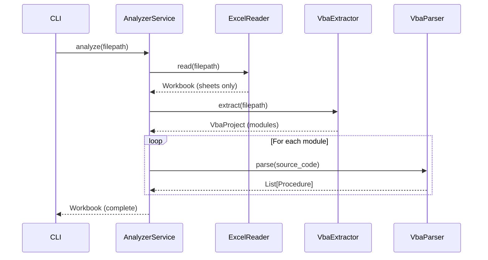
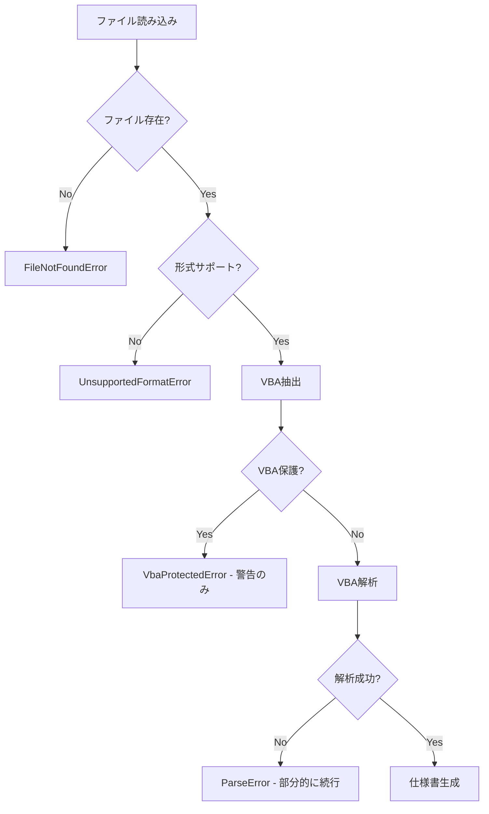

# Excel2Spec 詳細設計書

**Version**: 1.0
**Last Updated**: 2025-12-12
**Status**: Approved

---

## C4モデル詳細設計

### レベル3: コンポーネント図

```
┌─────────────────────────────────────────────────────────────────────────┐
│                           Excel2Spec CLI                                │
├─────────────────────────────────────────────────────────────────────────┤
│  ┌─────────────────────────────────────────────────────────────────┐    │
│  │                    Presentation Layer                           │    │
│  │  ┌──────────────┐  ┌─────────────────┐  ┌──────────────────┐   │    │
│  │  │   CLI App    │  │ MarkdownFormatter│  │  JsonFormatter   │   │    │
│  │  │  (Typer)     │  │                 │  │                  │   │    │
│  │  └──────┬───────┘  └────────┬────────┘  └────────┬─────────┘   │    │
│  └─────────┼───────────────────┼───────────────────┼──────────────┘    │
│            │                   │                   │                    │
│            ▼                   ▼                   ▼                    │
│  ┌─────────────────────────────────────────────────────────────────┐    │
│  │                    Application Layer                            │    │
│  │  ┌──────────────────────────────────────────────────────────┐   │    │
│  │  │                   AnalyzerService                         │   │    │
│  │  │  - analyze(filepath) -> Workbook                          │   │    │
│  │  │  - Uses: ExcelReaderPort, VbaExtractorPort, VbaParserPort │   │    │
│  │  └──────────────────────────────────────────────────────────┘   │    │
│  └─────────────────────────────────────────────────────────────────┘    │
│            │                                                            │
│            ▼                                                            │
│  ┌─────────────────────────────────────────────────────────────────┐    │
│  │                      Domain Layer                               │    │
│  │  ┌──────────┐ ┌──────────┐ ┌───────────┐ ┌──────────┐          │    │
│  │  │ Workbook │ │VbaProject│ │  Module   │ │Procedure │          │    │
│  │  └──────────┘ └──────────┘ └───────────┘ └──────────┘          │    │
│  │  ┌──────────┐ ┌──────────────┐                                  │    │
│  │  │ Variable │ │CellReference │                                  │    │
│  │  └──────────┘ └──────────────┘                                  │    │
│  └─────────────────────────────────────────────────────────────────┘    │
│            ▲                                                            │
│            │ implements                                                 │
│  ┌─────────────────────────────────────────────────────────────────┐    │
│  │                   Infrastructure Layer                          │    │
│  │  ┌─────────────┐  ┌──────────────┐  ┌─────────────┐            │    │
│  │  │ ExcelReader │  │ VbaExtractor │  │  VbaParser  │            │    │
│  │  │  (xlrd,     │  │  (oletools)  │  │  (regex)    │            │    │
│  │  │  openpyxl)  │  │              │  │             │            │    │
│  │  └─────────────┘  └──────────────┘  └─────────────┘            │    │
│  └─────────────────────────────────────────────────────────────────┘    │
└─────────────────────────────────────────────────────────────────────────┘
```

---

## コンポーネント詳細

### 1. CLI App (Presentation)

**責務**: コマンドライン引数の解析、ユーザーとの対話

```python
# インターフェース
class CLIApp:
    def analyze(input_file: Path, output: Path, format: str, verbose: bool) -> None
    def version() -> None
```

**依存関係**:
- AnalyzerService（Application層）
- MarkdownFormatter, JsonFormatter（Presentation層）

---

### 2. AnalyzerService (Application)

**責務**: 解析ワークフローのオーケストレーション

```python
# インターフェース
class AnalyzerService:
    def __init__(
        excel_reader: ExcelReaderPort,
        vba_extractor: VbaExtractorPort,
        vba_parser: VbaParserPort
    )
    def analyze(filepath: str) -> Workbook
```

**処理フロー**:


---

### 3. ExcelReader (Infrastructure)

**責務**: Excelファイルの読み込みとシート情報の抽出

```python
# インターフェース
class ExcelReader:
    def read(filepath: str) -> Workbook
    def _read_xls(filepath: str) -> Workbook  # xlrd使用
    def _read_xlsx(filepath: str) -> Workbook  # openpyxl使用
```

**サポートフォーマット**:
| 拡張子 | ライブラリ | VBAサポート |
|--------|-----------|------------|
| .xls   | xlrd      | 別途抽出   |
| .xlsx  | openpyxl  | なし       |
| .xlsm  | openpyxl  | あり       |

---

### 4. VbaExtractor (Infrastructure)

**責務**: ExcelファイルからVBAコードを抽出

```python
# インターフェース
class VbaExtractor:
    def extract(filepath: str) -> VbaProject
    def _detect_module_type(name: str) -> ModuleType
```

**モジュール種別判定**:
| パターン | ModuleType |
|---------|-----------|
| `Sheet*` | SHEET |
| `ThisWorkbook` | THISWORKBOOK |
| `*.cls` | CLASS |
| `*.frm` | FORM |
| その他 | STANDARD |

---

### 5. VbaParser (Infrastructure)

**責務**: VBAソースコードの構文解析

```python
# インターフェース
class VbaParser:
    def parse(source_code: str) -> List[Procedure]
    def _parse_parameters(params_str: str) -> List[Variable]
    def _find_procedure_end(lines: List[str], start: int, proc_type: str) -> int
```

**解析対象**:
- Sub / Function / Property 宣言
- パラメータ（ByVal/ByRef、型）
- 戻り値の型
- Public / Private アクセス修飾子

---

### 6. MarkdownFormatter (Presentation)

**責務**: Workbookを Markdown形式の仕様書に変換

```python
# インターフェース
class MarkdownFormatter:
    def format(workbook: Workbook) -> str
    def _format_module(module: Module) -> List[str]
    def _format_procedure(procedure: Procedure) -> List[str]
```

**出力構造**:
```markdown
# {filename} 仕様書
## シート一覧
## VBAモジュール一覧
### {module_name}
#### プロシージャ一覧
##### {procedure_name}
```

---

## データモデル詳細

### Workbook

```python
@dataclass
class Workbook:
    filename: str           # ファイル名
    sheets: List[str]       # シート名一覧
    vba_project: Optional[VbaProject]  # VBAプロジェクト（存在する場合）
```

### VbaProject

```python
@dataclass
class VbaProject:
    modules: List[Module]   # モジュール一覧
    is_protected: bool      # パスワード保護フラグ
```

### Module

```python
@dataclass
class Module:
    name: str                    # モジュール名
    module_type: ModuleType      # 種別（STANDARD/CLASS/FORM/SHEET/THISWORKBOOK）
    source_code: str             # ソースコード全体
    procedures: List[Procedure]  # プロシージャ一覧
    variables: List[Variable]    # モジュールレベル変数
```

### Procedure

```python
@dataclass
class Procedure:
    name: str                    # プロシージャ名
    procedure_type: ProcedureType # 種別（SUB/FUNCTION/PROPERTY_*）
    access: str                  # "Public" or "Private"
    parameters: List[Variable]   # パラメータ一覧
    return_type: Optional[str]   # 戻り値の型（Functionのみ）
    source_code: str             # プロシージャのソースコード
    line_start: int              # 開始行番号
    line_end: int                # 終了行番号
```

### Variable

```python
@dataclass
class Variable:
    name: str                    # 変数名
    var_type: Optional[str]      # 型（Variant, String, Long等）
    is_array: bool               # 配列フラグ
    scope: str                   # スコープ（local/module/global）
```

---

## エラーハンドリング設計

### カスタム例外クラス

```python
class Excel2SpecError(Exception):
    """基底例外クラス"""
    pass

class FileNotFoundError(Excel2SpecError):
    """ファイルが見つからない"""
    pass

class UnsupportedFormatError(Excel2SpecError):
    """サポートされていないファイル形式"""
    pass

class VbaExtractionError(Excel2SpecError):
    """VBA抽出に失敗"""
    pass

class VbaProtectedError(Excel2SpecError):
    """VBAプロジェクトがパスワード保護されている"""
    pass

class ParseError(Excel2SpecError):
    """構文解析エラー"""
    pass
```

### エラー処理フロー



---

## 設定・構成

### pyproject.toml

```toml
[project]
name = "excel2spec"
version = "0.1.0"
description = "Excel VBAを解析し仕様書を生成するCLIツール"
readme = "README.md"
requires-python = ">=3.11"
license = {text = "MIT"}
authors = [
    {name = "Your Name", email = "your.email@example.com"}
]
keywords = ["excel", "vba", "specification", "documentation"]
classifiers = [
    "Development Status :: 3 - Alpha",
    "Intended Audience :: Developers",
    "License :: OSI Approved :: MIT License",
    "Programming Language :: Python :: 3.11",
    "Programming Language :: Python :: 3.12",
]

dependencies = [
    "typer>=0.9.0",
    "rich>=13.0.0",
    "xlrd>=2.0.0",
    "openpyxl>=3.1.0",
    "oletools>=0.60.0",
]

[project.optional-dependencies]
dev = [
    "pytest>=7.4.0",
    "pytest-cov>=4.1.0",
    "mypy>=1.6.0",
    "ruff>=0.1.0",
    "pre-commit>=3.5.0",
]

[project.scripts]
excel2spec = "excel2spec.cli:app"

[build-system]
requires = ["hatchling"]
build-backend = "hatchling.build"

[tool.hatch.build.targets.wheel]
packages = ["src/excel2spec"]

[tool.ruff]
target-version = "py311"
line-length = 100
select = ["E", "F", "I", "N", "W", "UP"]

[tool.mypy]
python_version = "3.11"
strict = true
warn_return_any = true
warn_unused_ignores = true

[tool.pytest.ini_options]
testpaths = ["tests"]
pythonpath = ["src"]
```

---

**Last Updated**: 2025-12-12
**Author**: MUSUBI SDD Workflow
