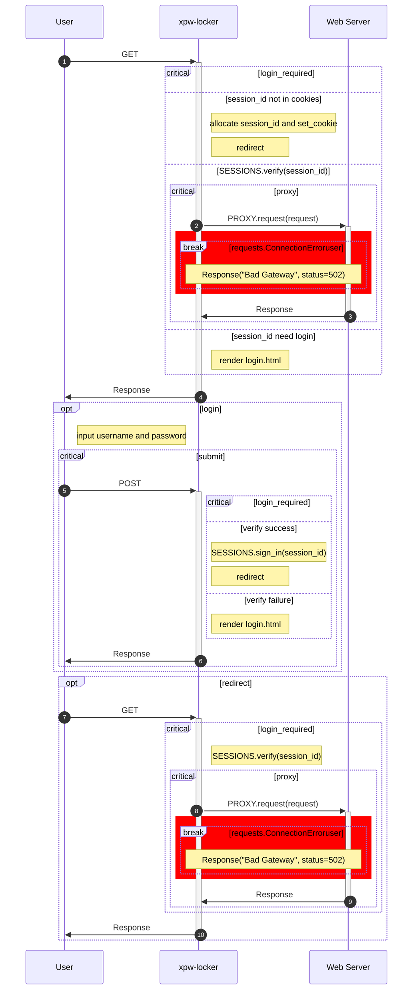

# xpw

> 密码管理和身份验证

## xpw-locker

> 访问认证：为 Web 页面接入身份验证

只需简单配置且无需改造任何既有代码，`xpw-locker` 可快速为任何 Web 页面启用身份验证。

### xpw-locker 技术原理

`xpw-locker` 是一个轻量级的 Web 代理服务，它在用户通过身份验证后，将用户请求转发到目标服务器并返回响应。


`xpw-locker` 的工作流程如下：

1. 首先检查用户的 session_id 是否在 cookies 中。
2. 如果 session_id 不在 cookies 中，`xpw-locker` 会分配一个新的 session_id，并将其增加至用户的 cookies 中，然后 `xpw-locker` 向用户返回重定向请求以刷新页面。
3. 如果 session_id 已在 cookies 中，`xpw-locker` 会检查 session_id 是否需要进行验证。
4. 如果 session_id 无需登录，`xpw-locker` 会将用户用户请求转发到目标服务器并返回响应。
5. 如果 session_id 需要登录，`xpw-locker` 会渲染登录页面并响应，用户输入用户名和密码后提交登录请求。
6. 如果用户名和密码验证成功，`xpw-locker` 会将登记 session_id 信息，然后 `xpw-locker` 向用户返回重定向请求以刷新页面。
7. 如果用户名和密码验证成功，`xpw-locker` 会再次渲染登录页面并响应。



### 安装 xpw-locker

```bash
pip install --upgrade xpw
```

### 使用 xpw-locker

创建配置文件 `xpwauth` 并增加用户和密码：

```toml
[users]
    demo = "demo"
```

```bash
xpw-locker --stdout --debug --target https://example.com/
```
