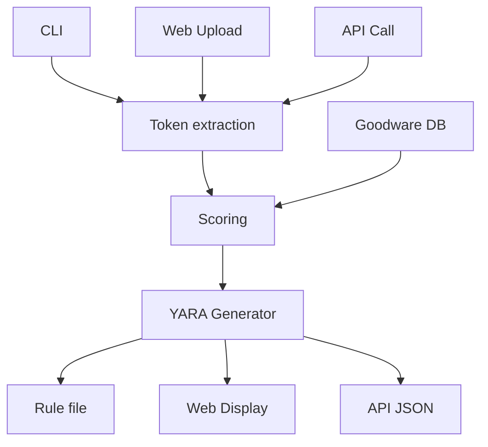

# yarobot

[](https://www.gnu.org/licenses/gpl-3.0)
[](https://www.python.org/)
[](https://www.rust-lang.org/)
[](https://pypi.org/project/yarobot/)

**[yarobot](https://github.com/ogre2007/yarobot)** is a high-performance YARA rule generator inspired by yarGen project, designed to automatically create quality YARA rules from malware samples while minimizing false positives through intelligent goodware database comparison.


## ✨ Features

- **Automated YARA Rule Generation**: Create both simple and super rules from malware samples
- **Advanced Scoring System**: String scoring with goodware database comparison
- **High-Performance Engine**: Rust-based core [stringZZ](https://github.com/ogre2007/stringzz) for fast file processing
- **Multiple Interfaces**: CLI, Python API, and web interface
- **Intelligent Filtering**: Automatic exclusion of common goodware strings for your specific dataset
- **Super Rules**: Automatic creation of rules that match multiple related samples

## 🏗️ Architecture


## 🛠 Installation

### 1. Install from PyPI

```bash
pip install yarobot
```

### 2. Install from Source

```bash
# Clone repository
git clone https://github.com/ogre2007/yarobot
cd yarobot

# Install in development mode
pip install -e .

# Or install with all dependencies
pip install ".[dev]"
```

## 📖 Quick Start

### 1. First-Time Setup (optional but recommended)

```bash
# Create a goodware database
mkdir -p ./dbs
py -m yarobot.database create /path/to/goodware/files --recursive --opcodes

# The database will be saved in ./dbs/
```

### 2. Generate Your First Rules

```bash
# Basic rule generation
py -m yarobot.generate /path/to/malware/samples \
  --output-rule-file my_rules.yar \
  --author "Your Name" \
  --ref "Case-001"

```

### 3. Launch Web Interface
```bash
# Start with your database
py -m yarobot.app -g ./dbs

# Access at http://localhost:5000
```
then locate http://localhost:5000
or use api directly from anywhere:
```bash
curl -X POST -F "files=@tests\\data\\binary" http://localhost:5000/api/analyze -F "min_score=5" -F "get_opcodes=true"
```

### 4. Advanced Configuration

```bash
py -m yarobot.generate /malware/samples -g <goodware dbs path> \
  --opcodes \
  --recursive \
  --author "My Security Team" \
  --ref "Internal Investigation 2024" \
  --superrule-overlap 5 \
  --strings-per-rule 15
```

### 5. Database Management

```bash
# Update existing database with new goodware samples
(TODO) py -m yarobot.database update /path/to/new/goodware --identifier corporate 

# Create new database from scratch
py -m yarobot.database create /path/to/goodware --opcodes
```

## 🔧 Configuration Options

### Rule Generation Options

- `--min-size`, `--max-size`: String length boundaries
- `--min-score`: Minimum string score threshold
- `--opcodes`: Enable opcode feature for additional detection capabilities
- `--superrule-overlap`: Minimum overlapping strings for super rule creation
- `--recursive`: Scan directories recursively
- `--excludegood`: Force exclusion of all goodware strings
- `--oe`: only executable extensions


### Database Options

- `--identifier`: Database identifier for multi-environment support
- `--update`: Update existing databases with new samples
- `--only-executable`: Only process executable file extensions


## 🤝 Contributing

1. Fork the repository
2. Create a feature branch
3. Make your changes
4. Add tests
5. Submit a pull request

## TODO's
- [x] Global project refactoring & packaging
- [x] Token extraction rewritten in Rust
- [x] Tests & CI/CD pipeline
- [x] Multiplatform PyPI release
- [x] HTTP service with web UI
- [ ] Store regex patterns in configuration
- [x] Wide/ASCII token merging
- [x] Token deduplication
- [ ] Fix/improve imphash/exports handling
- [ ] Include default databases
- [ ] Rule generation improvements
- [x] Separate token extraction to [stringZZ](https://github.com/ogre2007/stringzz) package
- [ ] Regexp generation
- [ ] LLM Scoring support

## 📄 License

This project is licensed under the GPLv3 License - see the [LICENSE](LICENSE) file for details.

## 🙏 Credits
- **yarGen** by Florian Roth (initial idea and implementation)
- **Pyo3** for Python-Rust integration
- **goblin** for binary parsing

## 📞 Support

- **Issues**: [GitHub Issues](https://github.com/ogre2007/yarobot/issues)